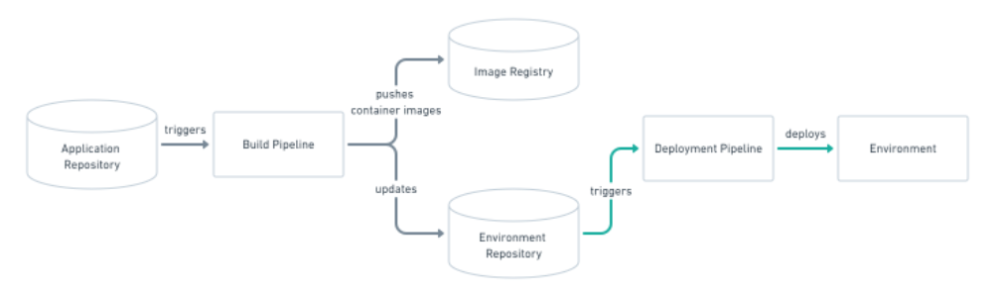
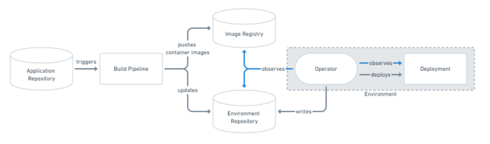
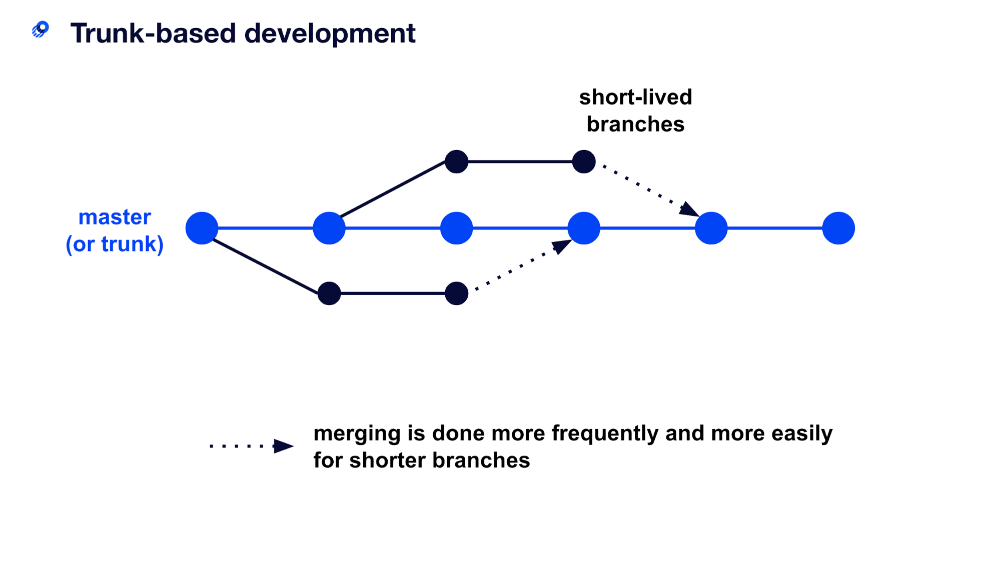
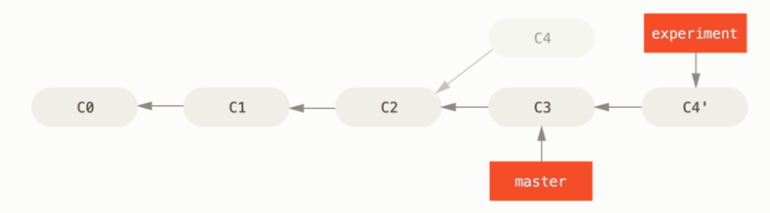
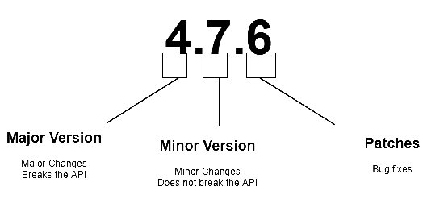

# Git Usage in the project

- [Git Usage in the project](#git-usage-in-the-project)
  - [About GitOps](#about-gitops)
    - [What is GitOps ?](#what-is-gitops-)
    - [How does GitOps work ?](#how-does-gitops-work-)
      - [Configuration as base](#configuration-as-base)
      - [Push-based deployments](#push-based-deployments)
      - [Pull-based deployments](#pull-based-deployments)
    - [GitOps Useful links](#gitops-useful-links)
  - [Branching Strategy in generated solutions](#branching-strategy-in-generated-solutions)
    - [Trunk based strategy](#trunk-based-strategy)
    - [Rebasing trunk branch](#rebasing-trunk-branch)
    - [Rebasing feature branch before the merge request](#rebasing-feature-branch-before-the-merge-request)
    - [Useful links about branching strategy](#useful-links-about-branching-strategy)
  - [Semantic Versionning](#semantic-versionning)
  - [Usefull Links about semantic versionning](#usefull-links-about-semantic-versionning)

## About GitOps

The codegen tool of the caf studio generate solution that use the GitOps approach to deploy resources on hyperscaler. This document gives you a quick overview of that deployment strategy.

### What is GitOps ?

GitOps is a way of implementing ***Continuous Deployment*** for cloud native applications. Its core tool is based on any type source version control.

The configuration of the application is generally detached from its source code. It takes the result of the build version that is tracked in the repository.

GitOps is based on a declarative description of the desired infrastructure's environments and automates the deployments throughout pipelines.

### How does GitOps work ?

#### Configuration as base

GitOps organizes the deployment process based on source control.

It mainly uses at least two repositories in order to deployment an application.

The application repository contains the source code of the application and the deployment manifests to deploy the application.

The environment configuration repository contains all deployment manifests of the currently desired infrastructure of a deployment environment.
It describes what applications and infrastructural services (message broker, service mesh, monitoring tools, …) should run with what configuration and version of the deployment environment.

#### Push-based deployments



#### Pull-based deployments



### GitOps Useful links

[GitOps | GitOps is Continuous Deployment for cloud native applications](https://www.gitops.tech/)

## Branching Strategy in generated solutions


### Trunk based strategy



The goal of this branching strategy is to be able to deliver fast to customers.

This strategy has its prerequisites that we will list below but it is the one the Azure practice team has chosen for CI/CD (Continuous Integration/Continuous Deployment).

The pre-requisites for working with that strategy is:

- short lived branches
- testing continuously
- validation built-in processes
- environment continuous deployment

### Rebasing trunk branch

When you are working with a team on a project, you will often need to rebase the defaut branch (ie: trunck) because your collegue has had his work merged onto it.



In the example above, if you need to rebase the change C4 onto master this is how you do it.

```bash
git checkout master
git pull --rebase
git checkout experiment
git rebase master
```

!!! warning
    If you are willing to push your branch code onto master (ie: main) and your remote and local branch have diverged you can then use the following command:
    ```bash
    git push --force-with-lease
    ```
    The previous command avoids overriding someone else’s work or commits.

!!! Note
    Now the master branch is called main

### Rebasing feature branch before the merge request

In order to have an as concise a possible git history you need to rebase your feature branch before starting your merge request (and before merging too).

If you have for example 5 commit on your feature branch and you want to squash them on one commit please use the following procedure

```bash
git rebase -i HEAD~5
git add .
```

You will be promped to select what you want to do with each commit and what will be the new commit message. Then you need to push your feature branch on the remote with force option

```bash
git push -f 
```

### Useful links about branching strategy

- [Five-minute overview - Trunk Based Development](https://trunkbaseddevelopment.com/5-min-overview/)
- [git rebase | Atlassian Git Tutorial](https://www.atlassian.com/git/tutorials/rewriting-history/git-rebase)
- [Git - Rebasing (git-scm.com)](https://git-scm.com/book/en/v2/Git-Branching-Rebasing)
- [Git rebase : qu'est-ce que c'est ? Comment s'en servir ? – Miximum](https://www.miximum.fr/blog/git-rebase/)
- [Rebase Master — tech.serhatteker.com](https://tech.serhatteker.com/post/2019-06/rebase-master/)
- [Adventures with git Rebasing (thoughtbot.com)](https://thoughtbot.com/blog/rebasing-your-branch-with-git-rebase-onto)

## Semantic Versionning

Azure Practice Team decided to use Semantic versionning (semver).

The versionning calculation is done by the Gitversion tool and based on the commit message and the gitversion configuration file.



For a version number MAJOR.MINOR.PATCH, increment

MAJOR version when you make incompatible changes
MINOR version when you add functionality in backwards compatible manner
PATCH version when you make backward compatible bug fixes

## Usefull Links about semantic versionning

- [Standard Version](https://github.com/conventional-changelog/standard-version)
