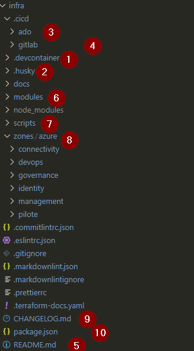
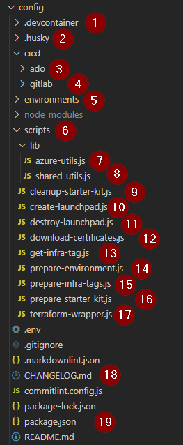
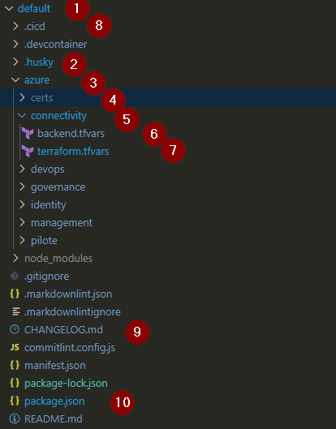

# Generated solution presentation

## Git Repositories Overview

The project is based on various git repositories that concur together to store the project code-based as defined in the [Git Ops Strategy](../2-git-usage-in-the-project.md)

Here is the full list of repositories created when you deploy a solution (except for the basic one and the empty one which are light solution for poc)

| Repositories Name | Purpose                                                               | name in repo manifest             |
| ----------------- | --------------------------------- | --------------------------------- |
| infra             | Location where the landing zones are defined in Terraform.            | datascience-gitops-infra          |
| tooling           | Location where all the tools for building and deployment are defined. | datascience-gitops-tooling        |
| infra-hpr         | Infrastructure hors prod environment                                  | datascience-gitops-infra-hpr      |
| infra-ppr         | Infrastructure Pre production  environment                            | datascience-gitops-infra-ppr      |
| infra-pro         | Infrastructure Production environment                                 | datascience-gitops-infra-pro      |
| apps-hpr          | applications hors prod repository environment                         | datascience-gitops-apps-hpr       |
| apps-ppr          | applications pre production repository environment                    | datascience-gitops-apps-ppr       |
| apps-pro          | applications production repository environment                        | datascience-gitops-apps-pro       |
| middleware-hpr    | middleware hors production repository environment                     | datascience-gitops-middleware-hpr |
| middleware-ppr    | middleware pre production repository environment                      | datascience-gitops-middleware-ppr |
| middleware-pro    | Production middleware repository environment                          | datascience-gitops-middleware-pro |
| helm              | Helm charts repository for Kubernetes deployments.                    | datascience-gitops                |
| documentation     | Documentation repository for the project.                             | datascience-gitops-documentation  |

: Repository list in the project

| Repositories Name | Repo category  |
| ----------------- | -------------- |
| infra             | infrastructure |
| tooling           | tooling        |
| infra-hpr         | environment    |
| infra-ppr         | environment    |
| infra-pro         | environment    |
| apps-hpr          | environment    |
| apps-ppr          | environment    |
| apps-pro          | environment    |
| middleware-hpr    | environment    |
| middleware-ppr    | environment    |
| middleware-pro    | environment    |
| helm              | helm           |
| documentation     | Documentation  |

: Repository category in the project

## Few word about the manifest files

At each time of the lifecycle of an environment we need to know which version of the infrastructure is deployed for a specific environment.

The table below present what we need to know to have a good observability of what is deployed on azure

| Date       | Version                        | Comments                                                                                       |
| ---------- | ------------------------------ | -----------------------------------------|
| 01/01/2025 | environement version: v0.0.1   | initial commit for both environment and infrastructure                                         |
|            | infrastructure version: v0.0.1 |                                                                                                |
| 02/01/2025 | environement version: v0.0.2   | that day only a change was performed on the variables . No impact on the infrastructure itself |
|            | infrastructure version: v0.0.1 |                                                                                                |
| 03/01/2025 | environement version: v0.0.3   | That day a new version of the infrastructure was created with majors change.                   |
|            | infrastructure version: v0.0.2 | A new version of the enviroment was also release to deploy that envrionemnt                    |

: versionning between infrastructure repo and environment repo

In each environment repository a specific file helps to track that link between the environment version and the infrastructure version which is called the manifest file.

This file is located at the root of each environment repository : **manifest.json**

here are a sample of the file

```json
{
  "environmentName": "<environement name>",
  "projectName": "<project name>",
  "cloudProviders": {
    "azure": {
      "REGION": "<azure region where the tfstate lives>",
      "ARM_SUBSCRIPTION_ID": "<azure subscription where the tfstate lives>",
      "ARM_TENANT_ID": "<tenant id>"
    }
  },
  "tooling": {
    "url": "<url of the git repository of the tooling code>",
    "branch": "main"
  },
  "infrastructure": {
    "tag": "v0.0.1",
    "url": "<url of the git repository of the infrastructure code>"
  },
  "environment": {
    "url": "<url of the git repository of the environement code>",
    "branch": "main"
  },
  "version": "0.0.1"
}
```

## Pipeline strategy

You will find here a short description of what is doing each pipeline on each repository.

On merge request, each pipeline is simply performing tests on the code based.

When the merge request is accepted, each pipeline performs  a release:

- automatic versioning work (update the version in package.json file)
- tag the repository.

Depending on the repository type, the merge request can also trigger various actions.

| repo category   | commit on MR branches                 | Merge on main                                                              |
| --------------- | ------------------------------------- | -------------------------------------------------------------------------- |
| Infra           | terraform format on each zone         | terraform format on each zone                                              |
|                 | terraform validate on each zone       | terraform validate on each zone                                            |
|                 | terraform tfsec static                | terraform tfsec static                                                     |
|                 |                                       | create release (update version, tags, generate changelog...)               |
| tooling         |                                       | create release (update version, tags, generate changelog...)               |
| environnments   | Checkout infra, gitops, env repo      | Checkout infra, gitops, env repository after having read the manifest file |
|                 | set environment to target default env | set environment to target default env                                      |
|                 | terraform format on each zone         | terraform format on each zone                                              |
|                 | terraform validate on each zone       | terraform validate on each zone                                            |
|                 | terraform init                        | terraform init for each zone                                               |
|                 | terraform plan                        | terraform plan for each zone                                               |
|                 |                                       | create release (update version, tags, generate changelog...)               |
|                 |                                       | terraform apply for each zone                                              |
| repo            | no cicd                               | no cicd                                                                    |
| helm            | helm validate                         | helm validate                                                              |
|                 |                                       | helm publish                                                               |

: Pipeline strategy for each repository category

## Infrastructure repository topology

### Objective of this repository

This repository is dedicated to manage the terraform infrastructure code for Azure.

### Code structure



### Code details

| id  | description                                                   |
| --- | ------------------------------------------------------------- |
| 1   | infrastructure dev container definition                       |
| 2   | husky configuration directory to manage git hook              |
| 3   | CICD pipeline definition for azure dev ops                    |
| 4   | CICD pipeline definition for gitlab                           |
| 5   | markdown documentation related to infrastructure repository   |
| 6   | azure dedicated terraform module location                     |
| 7   | node.js script location used in the infrastructure repository |
| 8   | terraform code for azure landing zone                         |
| 9   | Changlog file generated by the cicd process                   |
| 10  | package.json file                                             |

: Infrastructure repository présentation

!!! warning "After checkout you must"
    After the checkout of the repository, to use the npm command line you must launch the command `npm install` in the repo folder.

## Tooling repository topology

### Objective of this repository

This repository is dedicated to manage the tooling code for Azure and GCP. This tooling is mainly used by the CICD process but can also be used by developers when they need to validate the code.

### Code structure



### Code details

| id  | description                                                                                                                                                   |
| --- | -------------- |
| 1   | gitops tool dev container definition                                                                                                                          |
| 2   | husky configuration directory to manage git hook                                                                                                              |
| 3   | CICD pipeline definition for azure dev ops                                                                                                                    |
| 4   | CICD pipeline definition for gitlab                                                                                                                           |
| 5   | environment folder (not in this repo, added in .gitignore files)                                                                                              |
| 6   | azure dedicated terraform module location                                                                                                                     |
| 7   | node.js script library dedicated to azure automation, used in other scripts present in `./scripts` folder                                                     |
| 8   | node.js script used by both gcp and azure scripts                                                                                                             |
| 9   | node.js script to destroy all resources related to the starter kit deployment                                                                                 |
| 10  | node.js script that creates the launchpad (cloud storage and rights to manage tfstate files)                                                                  |
| 11  | node.js script that destroys the launchap                                                                                                                     |
| 12  | node.js script that allows the use to download the spn's certificates that is used to connect to the tfstate. Those certificates are located in the key vault |
| 13  | node.js script used to retrieve infrastructure repository tag list                                                                                            |
| 14  | node.js script used to select the current environment you are working on (default, prod, preprod ...)                                                         |
| 15  | node.js script used before pushing a new version of an environment to associate a version on the infrastructure with a version of the environment             |
| 16  | node.js script used to prepare a tenant to receive the starter kit assests                                                                                    |
| 17  | node.js script that is a wrapper to terraform cli command line (init, plan, apply)                                                                            |
| 18  | Changelog of the repository (its generation is automatically done by CICD process)                                                                            |
| 19  | Package.json file that holds the version of the repo and the command line script definition                                                                   |

!!! warning "After checkout you must"
    After the checkout of the repository, to use the npm command line you must launch the command `npm install` in the repo folder.

## Environment repository topology

### Objective of this repository

This repository is dedicated to store each environment terraform configuration files (backend and variable) for each landing zone. It also provides the project with
the definition of the CI/CD pipeline that enables the deployment on hyperscaler.

### Code structure



### Code details

| id  | description                                                                                                                     |
| --- | ------------------------------------------------------------------------------------------------------------------------------- |
| 1   | environment name (equal the directory name)                                                                                     |
| 2   | husky configuration directory to manage git hook                                                                                |
| 3   | that folder contains all information related to the azure deployment                                                            |
| 4   | certificate files used by spn to deploy on azure                                                                                |
| 5   | folder that container the backend.tfvars and the terraform.tfvars for the connectivity zone deployed in the default environment |
| 6   | terraform backend configuration for azure connectivity landing zone                                                             |
| 7   | terraform variable files for azure connectivity landing zone                                                                    |
| 8   | CICD folder that holds the definition of cicd pipeline used to build and deploy environment.                                    |
| 9   | Changelog of the repository (its generation is automatically done by CICD process)                                              |
| 10  | Package.json file that holds the version of the repo and the command line script definition                                     |

!!! warning "After checkout you must"
    After the checkout of the repository, to use the npm command line you must launch the command `npm install` in the repo folder.
