# Code your first feature

## Summary

- [Code your first feature](#code-your-first-feature)
  - [Summary](#summary)
  - [Requirements](#requirements)
  - [Feature development process](#feature-development-process)
    - [Hands on lab description](#hands-on-lab-description)
    - [Development Process](#development-process)
    - [Tasks details](#tasks-details)
  - [Get your Jira Ticket](#get-your-jira-ticket)
  - [Tool](#tool)
  - [Process](#process)
    - [Login on Jira](#login-on-jira)
  - [Start feature branch](#start-feature-branch)
    - [Tools](#tools)
    - [Process](#process-1)
      - [Pull the main branch](#pull-the-main-branch)
      - [Checkout the feature branch](#checkout-the-feature-branch)
    - [Useful links](#useful-links)
  - [Develop your feature](#develop-your-feature)
    - [Tools](#tools-1)
    - [Process](#process-2)
      - [Create a namming entry for the resource group](#create-a-namming-entry-for-the-resource-group)
      - [Add the `azurerm_resource_group` resource](#add-the-azurerm_resource_group-resource)
      - [Add the default tagging information](#add-the-default-tagging-information)
      - [Add a variable in the infra-hpr azure landing zone](#add-a-variable-in-the-infra-hpr-azure-landing-zone)
      - [Add the specific tags to the resource group](#add-the-specific-tags-to-the-resource-group)
  - [Test your feature](#test-your-feature)
    - [Tools](#tools-2)
    - [Declare the default environment as current environment](#declare-the-default-environment-as-current-environment)
    - [Perform the terraform init command](#perform-the-terraform-init-command)
    - [Perform the terraform plan command](#perform-the-terraform-plan-command)
  - [Publish your infrastructure branch](#publish-your-infrastructure-branch)
    - [Tools](#tools-3)
    - [Process](#process-3)
    - [Commit your change locally](#commit-your-change-locally)
    - [Rework on the git history if necessary](#rework-on-the-git-history-if-necessary)
    - [Push your local feature branch to the server](#push-your-local-feature-branch-to-the-server)
    - [Create a Merge Request](#create-a-merge-request)
    - [Fix issues and comments on MR](#fix-issues-and-comments-on-mr)
    - [Accept the merge request](#accept-the-merge-request)
    - [Pull the main branch](#pull-the-main-branch-1)
    - [Delete your feature branch](#delete-your-feature-branch)
  - [Update the infrastructure version in your environment infra-hpr](#update-the-infrastructure-version-in-your-environment-infra-hpr)

## Requirements

The following onboarding sections must be known and applied on your laptop:

- [Having performed the statup process](../../startup.md)

## Feature development process

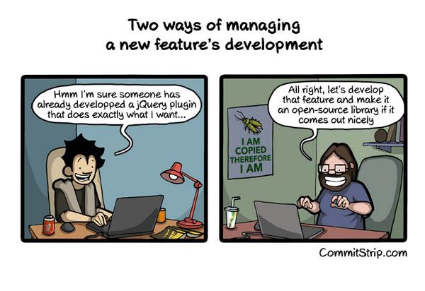

This section aims to present you the development process that you must implement to add features in the project. The tools involved in that process are Jira, Gitlab and VSCode.

### Hands on lab description

In this section we will add a sample feature in the code base. The feature consists in adding a resource group in the azure infra-hpr landing zone. This resource group must have a base name called "rg-samplefeature-northeu-001" (the naming must be set with the naming module).
That resource group must be tagged with the generic tag and a specific one called featuretag. That tag value must be set by using a variable that comes from the environment variables set.
This presentation assume that you use Jira and Gitlab in your project.

### Development Process

The following schema present the development process you must follow to be able to develop and deploy your feature:

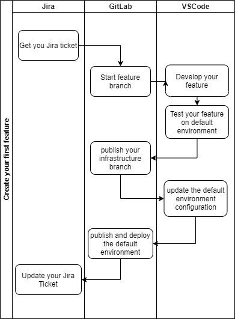

### Tasks details

| Tasks name                                 | Main Tools | Description                                                                                                                                                                              |
| ------------------------------------------ | ---------- | ---------------------------------------------------------------------------------------------------------------------------------------------------------------------------------------- |
| Get your jira ticket                       | Jira       | Identify your task in Jira and mark it as "In Progress."                                                                                                                                 |
| Start feature branches                     | GitLab     | On your laptop create a feature branch for infrastructure and default environment repository.                                                                                            |
| Develop your feature                       | VSCode     | With VSCode, add your terraform code inside your landing zone and update your environment variables.                                                                                     |
| Test your feature on default environment   | VSCode     | With the project tooling test your feature on the development environment.                                                                                                               |
| Publish your infrastructure branch         | GitLab     | Publish your infrastructure to generate a new version number by doing a Merge Request.                                                                                                   |
| Publish and deploy the default environment | Gitlab     | Change the infrastructure version number in your environment to point to the new infrastructure version. Publish the environment by doing a Merge Request that will trigger a deployment |
| Update your Jira Ticket                    | Jira       | To finish your work you must close your Jira ticket and update the work you spend on the task.                                                                                           |

## Get your Jira Ticket

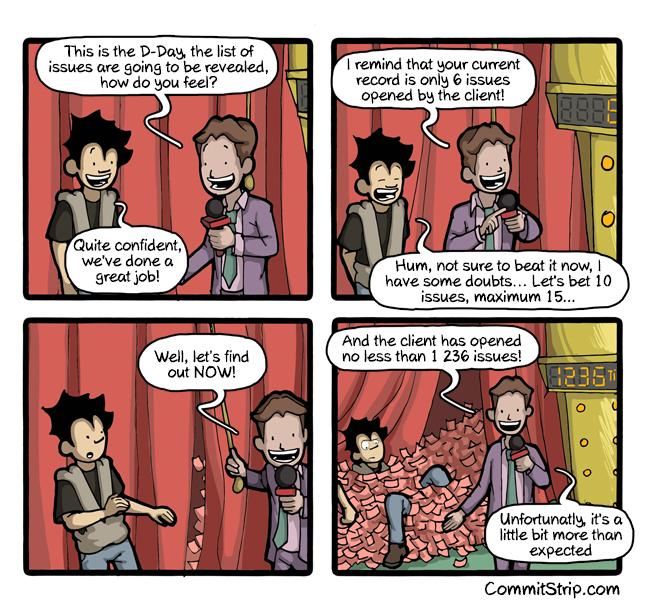

The project management is based on the Jira Ticketing tool from Atlassian. As soon as you are member of the project your will have access to that tool which
is located here [https://apriltechnologies.atlassian.net/jira/software/c/projects/DTECH/boards/754](https://apriltechnologies.atlassian.net/jira/software/c/projects/DTECH/boards/754/).

## Tool

The tool used at this stage is Jira.
If you need to have access to it please ask the project manager that can ask administrator to create an account for you.

## Process

1. Login on Jira
2. Search for your ticket on the backlog
3. Change the status of your task from "Open" to "On Process"
4. Locate your task on the "Savencia Board"

### Login on Jira

1. Log into the Jira portal with your prefered browser

2. Enter your credential which are your CUID and your AD-SUBS account password

3. You must now be connected

4. Navigate to the project backlog

5. Your are now in front of the project backlog

6. Search for your task, ensure your are the assignee and click on the workflow button

7. Click on the start progress button.

Your task is now "On Progress"

## Start feature branch


This chapter explain how to create a feature branch when you are working with multiple repositories in trunk based development process.

### Tools

The tools used in that process are:

1. git
2. repo
3. vscode

### Process

1. Open your project in vscode
2. Pull the main branch to be sure to have the last feature
3. Create your feature branch for infrastructure repository and default environment repository

#### Pull the main branch

1. In a terminal of your vscode launch the following command to check that you are on the main branch for all repo.

    ```bash
    repo status
    ```

2. You must see the the current branch for all repo is main:

   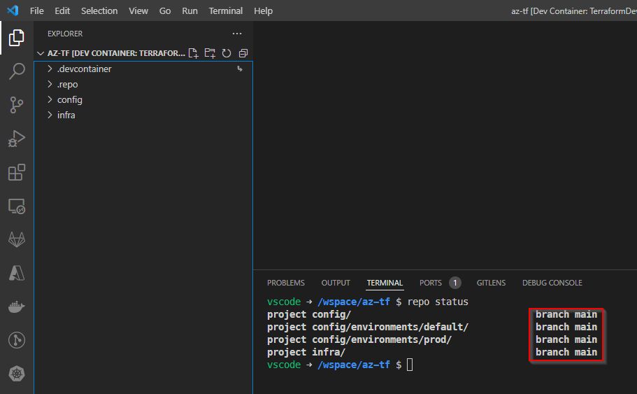

3. If you are not on the main branch launch the following command to checkout it.

    ```bash
    repo forall -c git checkout main  
    ```

4. If you are not on the main branch launch the following command to checkout it.

    ```bash
    repo forall -c git pull main  
    ```

#### Checkout the feature branch

1. It's now time to create the feature branch. When you are on development process you only need a new branch on the infrastructure and in the environment repositories.
   Create those branches by launching the follwing command:

    ```bash
    repo start feature/#<taskid>-<feature name> savencia-default savencia 
    ```

    Where taskid is the id of the Jira task associated with your feature and the feature name a short description of the aim of the feature.

    In our Hands on lab we will launch the following commnand:

    ```bash
    repo start feature/#267-add-resource-group-on-azure-connectivity  savencia-default savencia
    ```

2. Type the repo status command to check that the branch creation was well executed

    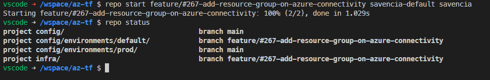

### Useful links

- [repo command line](https://source.android.com/setup/develop/repo)

## Develop your feature

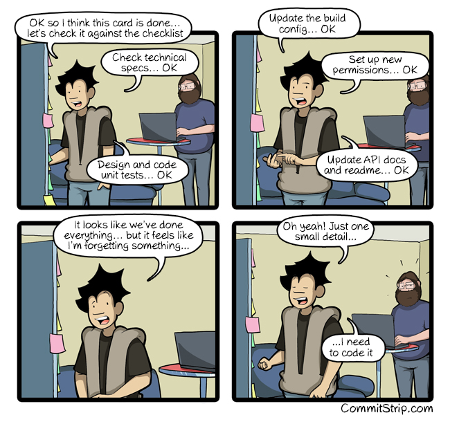

You are now ready to develop your new feature. This stage is mainly about terraform coding and it's not in the scope of this documentation, assuming that you are already fluent with that technology.

### Tools

The main tools used for that part of the process is vscode.

### Process

1. Create a naming entry in the namming section dedicated to the azure connectivity langing zone
2. Add the `azurerm_resource_group` azure resource in the azure connectivity landing zone
3. Add the default tagging information
4. Add a variable in the connectivity landing zone to define the resource group specific tag value
5. Add the variable value in the environment file
6. Add the specific tags to the resource group

#### Create a namming entry for the resource group

1. Open the file `infra/zone/azure/connectivity/naming.tf`
2. Add the follwing content at the end of the file

   ```
    resource "azurecaf_name" "samplefeature_rg" {
        name          = "samplefeature"
        resource_type = "azurerm_resource_group"
        suffixes      = [var.location_abbreviation, "001"]
    }
   ```

3. Save the file and close it

#### Add the `azurerm_resource_group` resource

1. Open the file `infra/zones/azure/ds-infra-hpr/resource-group.tf`
2. Add the following terraform block to declare the missing resource at the end of the file

    ```
    resource "azurerm_resource_group" "samplefeature_rg" {
        name     = azurecaf_name.samplefeature_rg.result
        location = var.location
    }
    ```

#### Add the default tagging information

1. Edit the `samplefeature_rg` you have just add to add the default tag information

    ```
    resource "azurerm_resource_group" "samplefeature_rg" {
        name     = module.naming.connectivity.samplefeature_rg
        location = var.location
        tags     = module.tagging.tags
    }
    ```

#### Add a variable in the infra-hpr azure landing zone

1. Open the file `infra/zones/azure/ds-infra-hpr/variables.tf`
2. Add a variable declaration in the specific connectivity section

    ```
    variable "featuretag" {
        description = "Specific tag value dedicated to illustrate the dev process"
        type        = string
        default     = "featuretagvalue"
    }
    ```

3. Save the file

Now you must declare a value that will be used when you will deploy the infra-hpr environment.

1. Open the variable file dedicated to the infra-hpr environment. That file is located here: `infra-hpr/azure/ds-infra-hpr/terraform.tfvars`
2. Add a line in that file to set the variable value:

    ```yaml
        featuretag = "default env feature tag"
    ```

3. Save the file

#### Add the specific tags to the resource group

Finally you must add the specific tag to the new resource group

1. open the file `infra/zones/azure/ds-infra-hpr/resource-group.tf`
2. Edit the new resource group definition to merge the default tag list and the new tag definition

    ```yaml
    resource "azurerm_resource_group" "rg" {
        name     = module.naming.connectivity.resource_group_name
        location = var.location
        tags     = merge(module.tagging.tags,{"featuretag" = var.featuretag})
    }
    ```

3. Save the file and close it.

## Test your feature

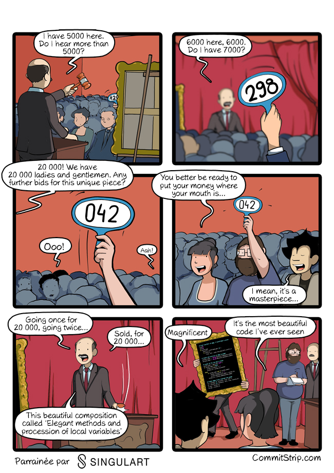

This step is dedicated to the test of your feature before creating the Merge Request. The test involves the default environment (or development environment) and the code of your feature located in the infra folder and in the default environment folder.

The test consists in:

1. Declare the infra-hpr environment as the current environment in your project
2. Perform the terraform init command
3. Perform the terraform plan command

And check that the plan produced is as expected.

### Tools

The main tool used for that step is `vscode`.

### Declare the default environment as current environment

You have to perform that action if:

- you never did it
- you have just checkout the project codebase
- you decide to change your current environment configuration

Here is the process:

1. navigate to the `tooling` folder
2. launch the following command

    ```bash
    npm run environment:prepare 
    ```

3. Answer the question asked by the tool:
   1. Answer "datascience" when the prompt ask for your current envrionment
   2. Leave the default answer when you are prompt for your landing zone list

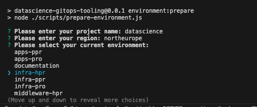

That action produce a .env file under the tooling folder.

### Perform the terraform init command

Launch the following command:

```bash
npm run terraform:init:ds-infra-hpr
```

You must have the following result

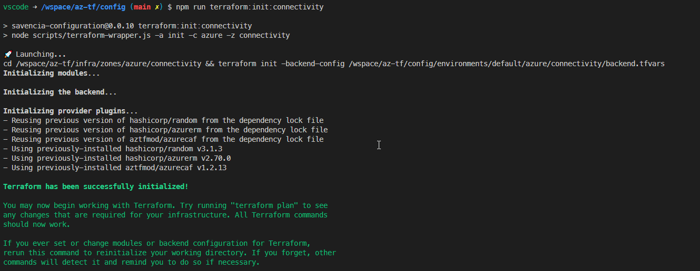

### Perform the terraform plan command

Launch the following command:

```bash
npm run terraform:plan:ds-infra-hpr
```

Take a look at your plan to ensure that your resource group will be created.

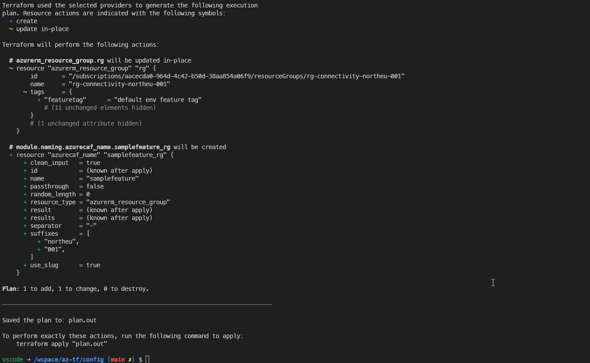

## Publish your infrastructure branch


When your code is fully tested on your development environment, it's now time to create a Merge Request to publish your new feature
to the main branch. But before that your needs to commit the code locally and if necessary rework on the git history to ensure to have a proper git history.

### Tools

The tools used here are

- vscode
- gitlab
- git

### Process

The publishing process consists of:

1. Commit your change locally
2. Rework on the git history if necessary
3. Push your local feature branch to the server
4. Create a Merge Request
5. If necessary fix issues and comments on the Merge Request
6. Accept the merge request
7. Switch to the main branch and pull the change
8. Delete your feature branch

### Commit your change locally

In order to commit your code, you need to:

1. In vscode terminal navigate to the  `./infra` directory
2. Launch the following command to add your code to the commit

    ```bash
    git add .
    ```

3. Commit your code in your local repository and complete the necessary information when prompted

    ```bash
    npm run commit
    ? Select the type of change that you\'re committing: feat:     A new feature
    ? What is the scope of this change (e.g. component or file name): (press enter to skip) azure connectivity
    ? Write a short, imperative tense description of the change (max 74 chars):
    (53) add a resource group in the connectivity landing zone
    ? Provide a longer description of the change: (press enter to skip)
    Add a landing zone in the connectivity landing zone on azure. Add common tag on it and a specific tag which value is defined per environment
    ? Are there any breaking changes? No
    ? Does this change affect any open issues? No
    ```

    This commit must launch the precommit hook which will launch behind the scene the following command:

    - npm run terraform:validate (run the terraform syntax validation on each zone)
    - npm run terraform:tfsec:static (run the terraform security plugin on each zone)
    - npm run terraform:fmt:fix (run the terraform format fix)
    - git add *\*.tf (add the change)
    - npm run terraform:docs (create the terraform documenation for each zone and modules)
    - npm run markdown:fix (fix the markdown linting)
    - git add *\*.md (add the markdown file to the commit)
    - npm run prettier:fix (fix the code style and lint the javascript files)
    - git add *\*.js (add the javascript files to the commit)
    - npx --no-install lint-staged

### Rework on the git history if necessary

If you have many commit on your feature branch, you must rework your git history to ensure that you have a ***limited number of significant commit***.

If you need more information on rewriting history, you can find more information here [rework git history](https://git-scm.com/book/en/v2/Git-Tools-Rewriting-History)

### Push your local feature branch to the server

After rewriting your history, you can push your local branch to the git remote:

```bash
git push --set-upstream orgin feature/#267-add-resource-group-on-azure-connectivity
```

After launching the command, you must have the following result.

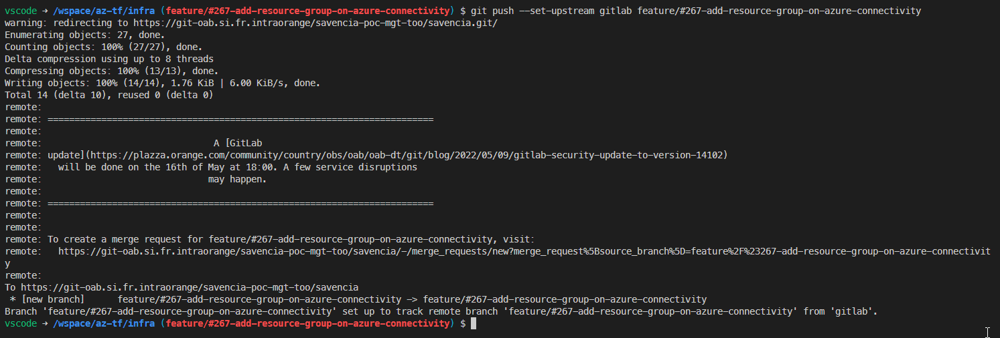

### Create a Merge Request

On the previous step, the commit process displays a direct link to create a Merge Request from your feature branch to the main branch on azure.

Click on it.

It must be something like this:

[https://git-oab.si.fr.intraorange/savencia-poc-mgt-too/savencia/-/merge_requests/new?merge_request%5Bsource_branch%5D=feature%2F%23267-add-resource-group-on-azure-connectivity](https://git-oab.si.fr.intraorange/savencia-poc-mgt-too/savencia/-/merge_requests/new?merge_request%5Bsource_branch%5D=feature%2F%23267-add-resource-group-on-azure-connectivity)

You must be redirected to the Gitlab interface:

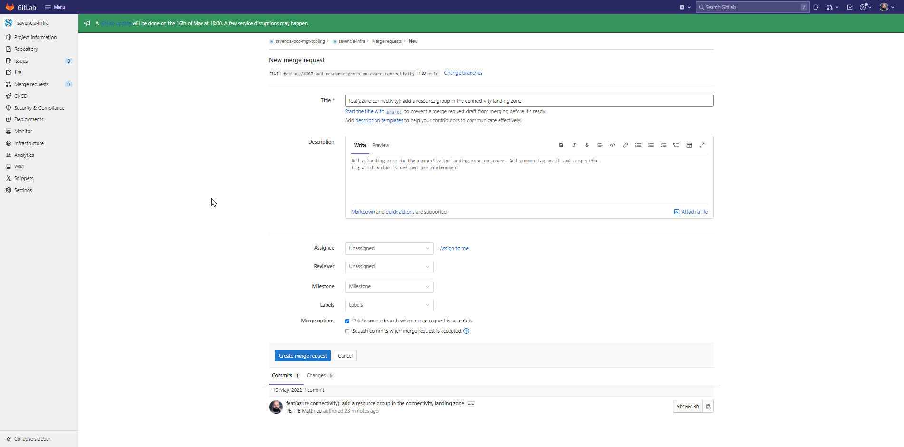

Click on the button `Create Merge Request`

### Fix issues and comments on MR

The MR will launch a build to perform some checks on your code. Other people can also make comments on your MR. If so, you must fix you change locally,
commit your code locally (using `npm run commit` command) and push them.

If you need to rework on your git, you will have to push your code by using the force option.

```bash
git push -f
```

### Accept the merge request

When the Merge Request is fully complete (no more active comments, the MR is approved, ...). You can click on the Merge Button.

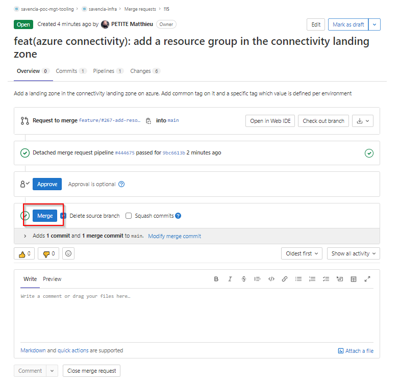

The merge action will launch a pipeline that will

1. Perform tests on the main branch
2. Produce the changelog
3. Tag the main branch with a new version

### Pull the main branch

When the Merge Request process is fully completed, you need to switch back you code to the main branch and perform a pull of the code

```bash
git checkout main 
git pull
```

!!! note:
    Ensure to be located in the infra repository before launching the command

Here is the result of a completed merge request on gitlab

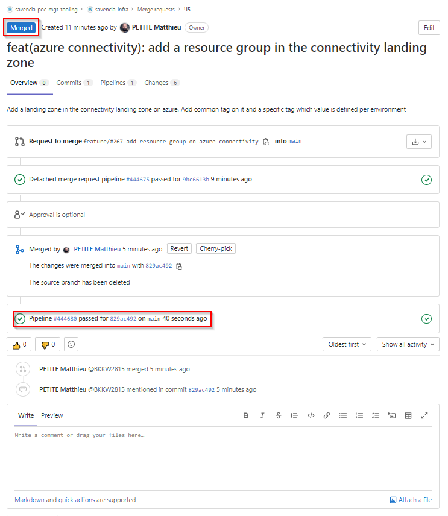

### Delete your feature branch

Finally, you can delete your feature branch on your laptop:

```bash
git branch -d feature/#267-add-resource-group-on-azure-connectivity
```

## Update the infrastructure version in your environment infra-hpr

Update the manifest.json file with the new version of the infrastructure or run the command:

```bash
npm run infra-tags:prepare
```

Commit the code in your infra-hpr environment repository by using the following command inside the repo:

```bash
npm run commit
```

You must at least commit the manifest.json file and all changes in the terraform.tfvars.

Create an MR on the main branch and follow the cicd process to see your code beeing deployed.
