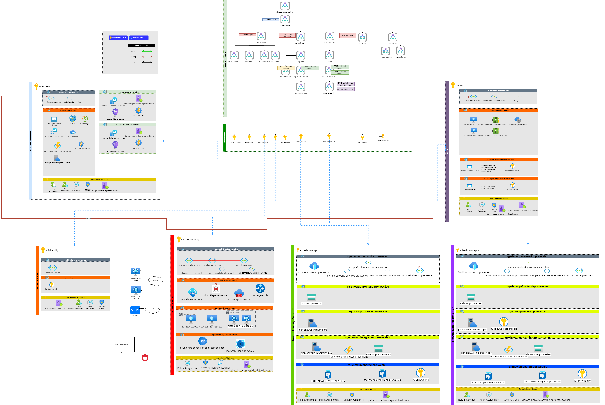
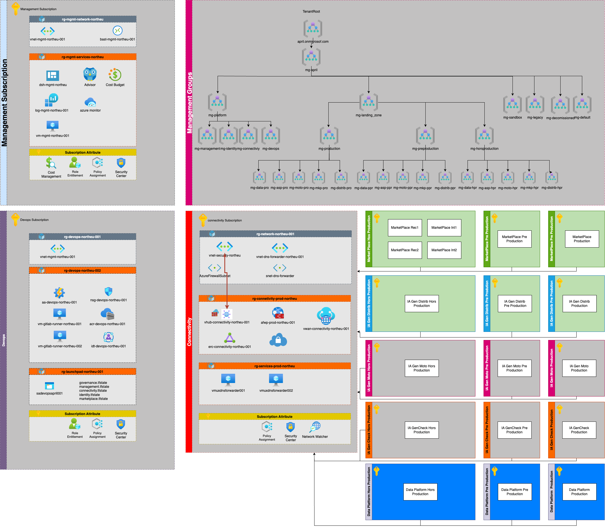

# Global Overview

## Document Scope

This document focuses on the design and implementation of the data science platform landing zone project. The Data Science Platform landing zone is one of the spokes in the hub and spoke architecture that supports the migration and operation of April’s applications on Azure. The Data Science Platform landing zone could host various services, such as Azure Kubernetes Service, Azure Data Factory, Azure Databricks, that enable data ingestion, transformation, for datascience purpose and model management and exposition. That landing zone also leverages the core landing zones for management, identity, and connectivity aspects, such as Azure Monitor, Azure Policy, Azure Firewall, and Azure VPN. The core landing zones are described in detail in the I/O Tech Teams documents vault. This document does not cover the core landing zones, except for the references that are relevant for the Data Science Platform landing zone.

Initially, this project aims to deliver only the outside production environment by following the topology deployed by the Datascience team. The value added by that initial project was to secure the infrastructure and the deployment of it by adding azure policies, security centre, and monitoring and following the IaC deployment pattern.

Today (June 2025) the project target the deployment of the Pre Production and Production platforms.

## April Datascience Landing zones architecture

The schema below represents the landing zone design that needs to be implemented to support the “Data Science Platform Project”. The layout described here is based on the enterprise scale pattern, defined as a best practice by Microsoft when companies aim to deploy on Azure some critical assets of their IT. Taking benefits of the Hub & Spoke pattern implemented in the enterprise scale is the best solution for April to handle the migration of the Data Science Platform applications on Azure as defined in the April Azure Strategy.

Details of each part are given in the next section.

The preceding enterprise-scale architecture represents the strategic design path and targets technical state of the art for azure environment.

This enterprise-scale architecture is modular by design. It is a foundational landing zone control plane that supports your application portfolios, whether the applications are being migrated or are newly developed and deployed to Azure. This architecture can scale alongside your business requirements, regardless of scale points.

By default, all resources will be deployed in North Europe Azure location.

The current project aims to deploy the Data Science Platform spokes and to connect them in the April Entreprise Scale landing zones.

The schema bellow present the general organisation of the April's Azure Tenant with the various landing zones deployed

