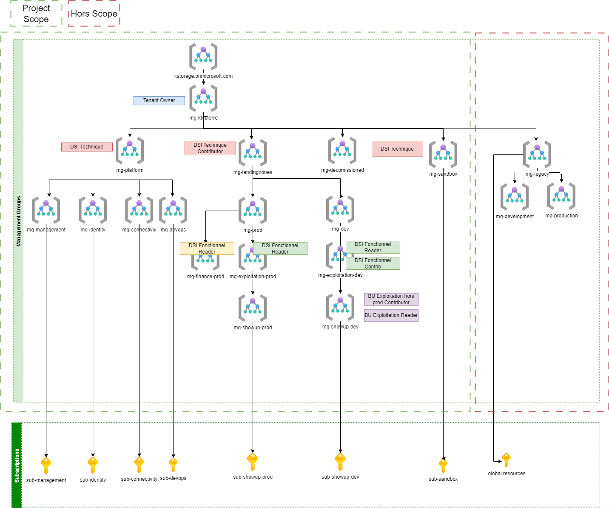

# Governance

## Management groups and subscription organization

### Project Requirements

The project requirements related to the management group and subscription organization are listed in the following table.

| ID           | Name                                                                                                                                                         |
| ------------ | ------------------------------------------------------------------------------------------------------------------------------------------------------------ |
| OBS-AZ-MG-01 | Klepierre’s must have a separate hierarchy of management group to facilitate the IAM and policy management between the new landing zone and the legacy ones. |
| OBS-AZ-MG-02 | The management group tree must be fewer than 6 levels deep (Azure restriction)                                                                               |
| OBS-AZ-MG-03 | Subscriptions associate to the core services of an enterprise scale landing zone must be grouped in a dedicated management group                             |
| OBS-AZ-MG-04 | Each application subscription must be linked to one dedicated management group                                                                               |
| OBS-AZ-MG-05 | Non-production assets must be isolated in different management group as soon as possible.                                                                    |
| OBS-AZ-MG-06 | The subscription created before the project must be replaced in the management group hierarchy                                                               |
| OBS-AZ-MG-07 | A naming convention must be defined for management group                                                                                                     |
| OBS-AZ-MG-08 | A naming convention must be defined for subscriptions created in the project                                                                                 |

: Management groups and subscription requirements

### Schema

The following schema illustrates the management groups and subscriptions and organizations in the Klepierre’s Tenant.

### Description

The management group topology is a 6-level group tree. This group hierarchy allows aggregating policies and initiatives assignments via Azure Policy and 
allows deploying the RBAC authorizations easily across the tenant.

The table below presents each level of management group’s hierarchy in the perimeter of the project.

| Level | Management Group                       | Sample value         | Management group level description                                                                                                                                                                                                                                                                          |
| :---- | :------------------------------------- | :------------------- | :---------------------------------------------------------------------------------------------------------------------------------------------------------------------------------------------------------------------------------------------------------------------------------------------------------- |
| 0     | Tenant Root level                      | Tenant Root Group    | Root of the management group tree                                                                                                                                                                                                                                                                           |
| 1     | Company level                          | mg-klepierre         | This level is created here for future needs. If Klepierre needs to create a separate structure for management groups for testing purpose, having that level will permit performing those actions without impact on the production side.                                                                     |
| 2     | Enterprise Scale Structure main level  | mg-platform          | That management group level separates the core landing zones from those dedicated to the applications or subsidiaries landing zones. That separation of concern gives the ability to declare specific policy regarding the critical landing zones (the core one) and others for applications landing zones. |
| 3     | Enterprise Scale Structure sub level 1 | mg-prod              | For core landing zones: This level is used to separate the different domain of responsibility related to the core landing zones such as the IAM, the management, the DevOps part,… For applications landing zones: That level is dedicated to environment type.                                             |
| 4     | Enterprise Scale Structure sub level 2 | mg-exploitation-prod | Only used for applications landing zones. That level is dedicated to separate the platform per business unit.                                                                                                                                                                                               |
| 5     | Enterprise Scale Structure sub level 3 | mg-showup-prod       | Only used for applications landing zones. That level is dedicated to separate the projects.                                                                                                                                                                                                                 |

: Management group level purpose

The next table describes the management groups that are implemented in the project associated with their level.

| Management group     | Level | Description                                                                                                                                                                                                                                                           |
| -------------------- | :---: | --------------------------------------------------------------------------------------------------------------------------------------------------------------------------------------------------------------------------------------------------------------------- |
| Tenant Root Group    |   0   | Top level management group                                                                                                                                                                                                                                            |
| mg-klepierre         |   1   | The Klepierre management group that hold all the Azure resources.                                                                                                                                                                                                     |
| mg-platform          |   2   | The assets under the responsibility of Klepierre. will be deployed in Azure by following the Enterprise Scale Landing zone patterns. That management group is dedicated to regrouping all objects related to the core component of the enterprise scale landing zone. |
| mg-landingzones      |   2   | This management group is related to all Klepierre’s application landing zones                                                                                                                                                                                         |
| mg-decomissionned    |   2   | This management group will hold the decommissioned subscriptions                                                                                                                                                                                                      |
| mg-sandbox           |   2   | This management group will hold the sandbox subscriptions used for training and learning                                                                                                                                                                              |
| mg-legacy            |   2   | This management group will hold the legacy deployment                                                                                                                                                                                                                 |
| mg-identity          |   3   | This management group will hold the subscription dedicated to the identity management of the project                                                                                                                                                                  |
| mg-devops            |   3   | This management group will hold the subscription dedicated to the DevOps management of the project (mainly for storing TFState)                                                                                                                                       |
| mg-management        |   3   | This management group will hold the subscription dedicated to the management of the project (Dashboarding, log analytics, …)                                                                                                                                          |
| mg-connectivity      |   3   | This management group will hold the subscription dedicated to the connectivity of the project (vWan, Firewall, …)                                                                                                                                                     |
| mg-prod              |   3   | This management group will group all landing zones that hold workloads for the production environments                                                                                                                                                                |
| mg-finance-prod      |   4   | This management group will group all landing zones that hold workloads for the finance business unit production                                                                                                                                                       |
| mg-exploitation-prod |   4   | This management group will group all landing zones that hold workloads for the exploitation business unit pre production                                                                                                                                              |
| mg-showup-prod       |   5   | This management group will group all landing zones that hold workloads for showup application in production                                                                                                                                                           |
| mg-dev               |   3   | This management group will group all landing zones that hold workloads for the development landing zone                                                                                                                                                               |
| mg-exploitation-dev  |   4   | This management group will group all landing zones that hold workloads for the exploitation business unit development                                                                                                                                                 |
| mg-showup-dev        |   5   | This management group will group all landing zones that hold workloads for the showup application in development                                                                                                                                                      |

: Management group description

Subscriptions help us to have an isolated management, billing, and scale within the tenant. 6 subscriptions are necessary to support the project:

| Subscription     | Owner     | Description                                                                                   |
| :--------------- | :-------- | :-------------------------------------------------------------------------------------------- |
| sub-devops       | Klepierre | This subscription is dedicated to DevOps management, mainly for storing Terraform state files |
| sub-connectivity | Klepierre | This subscription is dedicated to connectivity resources such as vWAN and Firewall            |
| sub-identity     | Klepierre | This subscription is dedicated to identity management resources                               |
| sub-management   | Klepierre | This subscription is dedicated to management resources like dashboarding and log analytics    |
| sub-showup-prod  | Klepierre | This subscription is dedicated to the showup application in production                        |
| sub-showup-dev   | Klepierre | This subscription is dedicated to the showup application in development                       |

: Subscriptions list

Note: All other subscriptions are out of the scope of this document. Nevertheless, it is recommended for Klepierre to follow the same naming guidelines when adding new subscriptions.

Here is the Subscription Id Table:

| Subscription     | Subscription ID            |
| :--------------- | :------------------------- |
| sub-devops       | To Be Defined when created |
| sub-connectivity | To Be Defined when created |
| sub-identity     | To Be Defined when created |
| sub-management   | To Be Defined when created |
| sub-showup-prod  | To Be Defined when created |
| sub-showup-dev   | To Be Defined when created |

: Subscription ids list

## Security governance and compliance

This critical design area establishes the policies to be put in place as well as their respective scope.

### Project requirements

The project requirements related to the security and compliance are listed in the following table.

| ID            | Name                                                                                         |
| ------------- | -------------------------------------------------------------------------------------------- |
| OBS-AZ-SEC-01 | Klepierre’s tenant must implement security policies at management group level                |
| OBS-AZ-SEC-02 | Digital Service Governance most valuable product must be deployed on Klepierre Azure tenant. |
| OBS-AZ-SEC-03 | Specific tenant policy may be added to complete the Digital Service MVP                      |

: Management groups and subscription requirements

### Description

Azure Policy helps to enforce organizational standards and to assess compliance at-scale. Through its compliance dashboard, it provides an aggregated view to evaluate the overall state of the environment, with the ability to drill down to the per-resource, per-policy granularity. It also helps to bring your resources to compliance through bulk remediation for existing resources and automatic remediation for new resources.

Common use cases for Azure Policy include implementing governance for resource consistency, regulatory compliance, security, cost, and management. Policy definitions for these common use cases are already available in your Azure environment as built-ins to help you get started.

The description of Azure policy can be found here: [https://docs.microsoft.com/en-us/azure/governance/policy/overview](https://docs.microsoft.com/en-us/azure/governance/policy/overvi

### Project Risks

#### Risk Overview

| Risk ID | Risk Category | Risk Description                                                                            | Risk Owner    |
| :------ | :------------ | :---------------------------------------- | :------------ |
| R01     | Security      | Unauthorized access to cloud services                                                       | Platform Team |
| R02     | Cost          | Overspending on cloud services due to overprovisioning and lack of monitoring               | Platform Team |
| R03     | Security      | Virtual machines not monitored allowing inconsistent Inventory                              | Platform Team |
| R04     | Security      | Resources accessed through an unsecure network                                              | Platform Team |
| R05     | Security      | Data loss                                                                                   | Platform Team |
| R06     | Security      | Activity on Azure platform not logged and notification of malicious activity not configured | Platform Team |
| R07     | Compliance    | Platform inconsistency                                                                      | Platform Team |
| R08     | Security      | Admin role underestimated for subscription administration                                   | Platform Team |
| R09     | Security      | Compliance and security not enforced                                                        | Security Team |

: Risks overview

#### Risk Management Details

| Risk ID | Probability | Impact | Priority | Level | Strategy | Management Enforcement                                                                                     | Closure Date |
| :------ | :---------- | :----- | :------- | :---- | :------- | :-----------------------------------  | :----------- |
| R01     | High        | High   | High     | 1     | Mitigate | Microsoft Entra ID multifactor authentication (MFA). Microsoft Entra ID Governance monthly access reviews. | N/A          |
| R02     | High        | High   | High     | 2     | Mitigate | Set budgets and alerts for workloads. Review and apply Advisor cost recommendations.                       | N/A          |
| R03     | High        | High   | High     | 1     | Mitigate | Add Microsoft Monitoring agent on all Virtual machines                                                     | N/A          |
| R04     | High        | High   | High     | 1     | Mitigate | Add network monitoring and specific architecture and configuration for private communications              | N/A          |
| R05     | High        | High   | High     | 1     | Mitigate | Configure specific backup                                                                                  | N/A          |
| R06     | High        | High   | High     | 1     | Mitigate | Log all activities to a log analytics workspace                                                            | N/A          |
| R07     | High        | High   | High     | 2     | Mitigate | Use policies to frame Azure cloud usage                                                                    | N/A          |
| R08     | High        | High   | High     | 2     | Mitigate | Use EntraID security groups with several members in general                                                | N/A          |
| R09     | High        | High   | High     | 1     | Mitigate | Use initiative Microsoft Cloud Security Benchmark                                                          | N/A          |

: Risk Management Details

### Governance Policies

| Risk ID | Policy Display Name                                                                                             | Policy Name                          | Version | Type    | Category        | Scope        | Params  |
| ------- | :-------------------------------- | :----------------------------| :--------- | :--------- | :-------------- | :----------- | :----------------------- |
| R03     | Linux virtual machines should have Azure Monitor Agent installed                                                | 1afdc4b6-581a-45fb-b630-f1e6051e3e7a | 3.4.0   | BuiltIn | Monitoring      | mg-klepierre | \{\}                                        |
| R03     | Linux virtual machine scale sets should have Azure Monitor Agent installed                                      | 32ade945-311e-4249-b8a4-a549924234d7 | 3.4.0   | BuiltIn | Monitoring      | mg-klepierre | \{\}                                        |
| R03     | Configure Linux machines to run Azure Monitor Agent and associate them to a Data Collection Rule                | 118f04da-0375-44d1-84e3-0fd9e1849403 | 3.2.0   | BuiltIn | Monitoring      | mg-klepierre | \{\}                                        |
| R03     | Configure Windows machines to run Azure Monitor Agent and associate them to a Data Collection Rule              | 9575b8b7-78ab-4281-b53b-d3c1ace2260b | 3.2.0   | BuiltIn | Monitoring      | mg-klepierre | \{\}                                        |
| R03     | Windows virtual machines should have Azure Monitor Agent installed                                              | c02729e5-e5e7-4458-97fa-2b5ad0661f28 | 3.2.0   | BuiltIn | Monitoring      | mg-klepierre | \{\}                                        |
| R03     | Windows virtual machine scale sets should have Azure Monitor Agent installed                                    | 3672e6f7-a74d-4763-b138-fcf332042f8f | 3.2.0   | BuiltIn | Monitoring      | mg-klepierre | \{\}                                        |
| R01     | Audit usage of custom RBAC rules                                                                                | a451c1ef-c6ca-483d-87ed-f49761e3ffb5 | 1.0.1   | BuiltIn | IAM             | mg-klepierre | \{\}                                        |
| R01     | Blocked accounts with owner permissions on Azure resources should be removed                                    | 0cfea604-3201-4e14-88fc-fae4c427a6c5 | 1.0.0   | BuiltIn | IAM             | mg-klepierre | \{\}                                        |
| R08     | There should be more than one owner assigned to your subscription                                               | 09024ccc-0c5f-475e-9457-b7c0d9ed487b | 3.0.0   | BuiltIn | IAM             | mg-klepierre | \{\}                                        |
| R04     | Internet-facing virtual machines should be protected with network security groups                               | f6de0be7-9a8a-4b8a-b349-43cf02d22f7c | 3.0.0   | BuiltIn | Security        | mg-klepierre | \{\}                                        |
| R04     | Subnets should be associated with a Network Security Group                                                      | e71308d3-144b-4262-b144-efdc3cc90517 | 3.0.0   | BuiltIn | Security        | mg-klepierre | \{\}                                        |
| R04     | Storage accounts should restrict network access                                                                 | 34c877ad-507e-4c82-993e-3452a6e0ad3c | 1.1.1   | BuiltIn | Security        | mg-klepierre | \{\}                                        |
| R04     | Secure transfer to storage accounts should be enabled                                                           | 404c3081-a854-4457-ae30-26a93ef643f9 | 2.0.0   | BuiltIn | Security        | mg-klepierre | \{\}                                        |
| R04     | Storage accounts should allow access from trusted Microsoft services                                            | c9d007d0-c057-4772-b18c-01e546713bcd | 1.0.0   | BuiltIn | Security        | mg-klepierre | \{\}                                        |
| R04     | Automation account variables should be encrypted                                                                | 3657f5a0-770e-44a3-b44e-9431ba1e9735 | 1.1.0   | BuiltIn | Security        | mg-klepierre | \{\}                                        |
| R06     | Azure subscriptions should have a log profile for Activity Log                                                  | 7796937f-307b-4598-941c-67d3a05ebfe7 | 1.0.0   | BuiltIn | Security        | mg-klepierre | \{\}                                        |
| R06     | Email notification to subscription owner for high severity alerts should be enabled                             | 0b15565f-aa9e-48ba-8619-45960f2c314d | 2.1.0   | BuiltIn | Security        | mg-klepierre | \{\}                                        |
| R06     | Subscriptions should have a contact email address for security issues                                           | 4f4f78b8-e367-4b10-a341-d9a4ad5cf1c7 | 1.0.1   | BuiltIn | Security        | mg-klepierre | \{\}                                        |
| R06     | Enable Azure Security Center on your subscription                                                               | ac076320-ddcf-4066-b451-6154267e8ad2 | 1.0.1   | BuiltIn | Security        | mg-klepierre | \{\}                                        |
| R05     | Key Vault secrets should have an expiration date                                                                | 98728c90-32c7-4049-8429-847dc0f4fe37 | 1.0.2   | BuiltIn | Data Protection | mg-klepierre | \{\}                                        |
| R05     | Key vaults should have purge protection enabled                                                                 | 0b60c0b2-2dc2-4e1c-b5c9-abbed971de53 | 2.1.0   | BuiltIn | Data Protection | mg-klepierre | \{\}                                        |
| R05     | Configure backup on virtual machines without a given tag to a new recovery services vault with a default policy | 98d0b9f8-fd90-49c9-88e2-d3baf3b0dd86 | 9.4.0   | BuiltIn | Data Protection | mg-klepierre | \{\}                                        |
| R05     | Key vaults should have soft delete enabled                                                                      | 1e66c121-a66a-4b1f-9b83-0fd99bf0fc2d | 3.0.0   | BuiltIn | Data Protection | mg-klepierre | \{\}                                        |
| R07     | Allowed virtual machine size SKUs                                                                               | cccc23c7-8427-4f53-ad12-b6a63eb452b3 | 1.0.1   | BuiltIn | Compute         | mg-klepierre | \{\}                                        |
| R07     | Audit VMs that do not use managed disks                                                                         | 06a78e20-9358-41c9-923c-fb736d382a4d | 1.0.0   | BuiltIn | Compute         | mg-klepierre | \{\}                                        |
| R04     | Configure storage accounts to disable public network access                                                     | a06d0189-92e8-4dba-b0c4-08d7669fce7d | 1.0.1   | BuiltIn | Storage         | mg-klepierre | \{\}                                        |
| R04     | Secure transfer to storage accounts should be enabled                                                           | 404c3081-a854-4457-ae30-26a93ef643f9 | 2.0.0   | BuiltIn | Storage         | mg-klepierre | \{\}                                        |
| R07     | Storage accounts should be limited by allowed SKUs                                                              | 7433c107-6db4-4ad1-b57a-a76dce0154a1 | 1.1.0   | BuiltIn | Storage         | mg-klepierre | \{\}                                        |
| R04     | Storage accounts should restrict network access using virtual network rules                                     | 2a1a9cdf-e04d-429a-8416-3bfb72a1b26f | 1.0.1   | BuiltIn | Storage         | mg-klepierre | \{\}                                        |
| R07     | Inherit a tag from the subscription if missing                                                                  | 40df99da-1232-49b1-a39a-6da8d878f469 | 1.0.0   | BuiltIn | Tags            | mg-klepierre | \{\}                                        |
| R07     | Require a tag on resources                                                                                      | 871b6d14-10aa-478d-b590-94f262ecfa99 | 1.0.1   | BuiltIn | Tags            | mg-klepierre | \{\}                                        |
| R07     | Allowed locations                                                                                               | e56962a6-4747-49cd-b67b-bf8b01975c4c | 1.0.0   | BuiltIn | General         | mg-klepierre | \["North Europe", "West Europe", "Global"\] |
| R09     | Microsoft cloud security benchmark                                                                              | 1f3afdf9-d0c9-4c3d-847f-89da613e70a8 | 57.51.0 | BuiltIn | Security Center | mg-klepierre | \{\}                                        |

: Governance Policies
