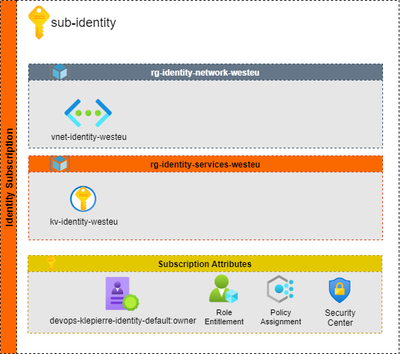
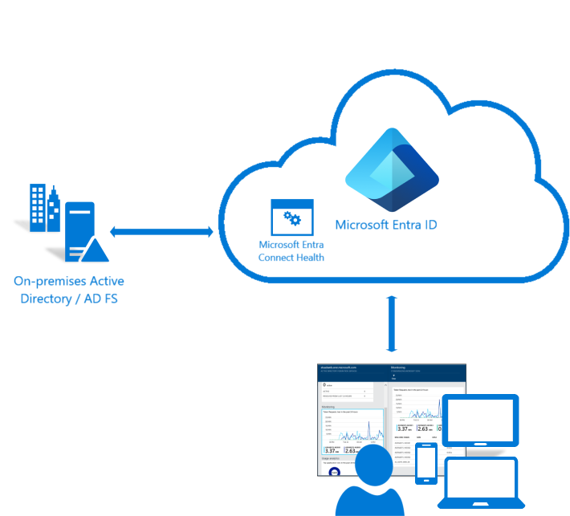
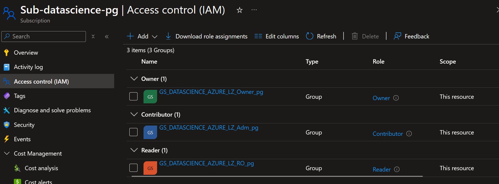

# Identity and access management

Identity provides the basis for a wide variety of security assurance. It grants access based on identity authentication and authorization controls in cloud services. Access control protects data and resources and helps decide which requests should be permitted.

The technological landscape in the enterprise is becoming complex and heterogenous. To manage compliance and security for this environment, identity and access management lets the right individuals access the right resources at the right time for the right reasons.

Identity and access management is boundary security in the public cloud. It must be treated as the foundation of any secure and fully compliant public cloud architecture. Azure offers a comprehensive set of services, tools, and reference architectures to help organizations make highly secure, operationally efficient environments.

## Identity requirements

| ID                               | Name                                                                                                              |
| :------------------------------  | :-------------------------------------------------------------------------------------------------------------|
| OCB-AZ-IAM-01  | April is the sole responsible to manage user rights within the Azure tenant                                                    | 
| OCB-AZ-IAM-002 | April must be able to manage Azure identity thought it’s on-premises Active Directory infrastructure.                          |
| OCB-AZ-IAM-003 | The number of groups added in Active Directory, used to manage the connectivity to Azure services must be limited.                  |
| OCB-AZ-IAM-004 | April’s application developers that must have access to Azure services (i.e. Azure portal) must be declare in a specific group |
| OCB-AZ-IAM-005 | April’s IT members that must have access to Azure services (i.e. Azure portal) must be declare in a specific group             |
| OCB-AZ-IAM-006 | Sub-contractors must be declared in specific groups    |

:Identity Requirements

## Identity Schema

The following figure presents the identity landing zone with its related resources

That landing zone is related to the governance one (used to defined policies). The main items build for that zone is role and right definition. Its purpose is to define who has the right to perform actions on specific scopes. In the Digital Service starterkit, the RBAC information are provided in the governance aera.

The first element involved in access right strategy is the user object and its related group objects. Azure provides a directory to define those elements called Azure Active Directory. To meet the project requirements, April’s administrators must not define users or groups in the Azure Active Directory but prefers to manage them through their on-premises Active Directory Forest.

This scenario is available by implementing the Azure Active Director Connect solution. This software synchronizes groups and users between Active Directory and Azure Active Directory in a bidirectional way.

## Identity Description

The deployment of Azure Active Directory Connect is out of scope of this project and is under the responsibility of April IT Team. This chapter will also be focused on:
The list of users and groups that should be created on April’s Active Directory and sync to the April’s Azure Active Directory tenant.

To enable the DevOps deployment solution implemented in the project, Azure administrator must complementarily deploy Application’s resources dedicated to performing the Terraform “plan” and “apply” steps. With those applications resources comes Service Principal Identity. That chapter identify the list of those applications and the rights they must have across the enterprise scale architecture deployed for the April project.

## Applications

The following table presents the necessary applications that must be created in the April’s Azure Active directory.

| Zone                         | Application (Service principal)    | Purpose   |
| :--------------------------- | :--------------------------------- | :---------------------------------------------------------------------------- |
| dataplatform hors prod       | devops-april-datascience-hpr       | This application is used to manage resources in dataplatform subscription  |

: Applications for Zones

The creation of that application is part of the starterkit initialization process and is fully automated.

The usage of the launchpad application is mandatory as it is part of the Digital Service Starter Kit. To have more information on that, please refers to the Devops Chapter of this document.

## Custom roles

Two roles must be added in the Azure Active Directory tenant:

----------------------------------------------------------------------------------
Custom Role Name    Rights
------------------- --------------------------------------------------------------
Governance          'Microsoft.Management/managementGroups/write',
                    'Microsoft.Management/managementGroups/read',
                    'Microsoft.Management/managementGroups/subscriptions/write',
                    'Microsoft.Authorization/roleAssignments/read',
                    'Microsoft.Authorization/roleAssignments/write',
                    'Microsoft.Authorization/roleAssignments/delete',
                    'Microsoft.Authorization/policyDefinitions/write',
                    'Microsoft.Authorization/policyDefinitions/delete',
                    'Microsoft.Authorization/roleDefinitions/read',
                    'Microsoft.Authorization/roleDefinitions/write',
                    'Microsoft.Authorization/roleDefinitions/delete',
                    'Microsoft.Storage/storageAccounts/listkeys/action'

Devops Users Role   'Microsoft.Storage/storageAccounts/listkeys/action'
----------------------------------------------------------------------------------
:Azure Custom Roles

The creation of those roles is part of the starterkit initialization process and the governance deployment. Consequently, it’s fully automated.

Az the starterkit was already deployed for the marketplace landing zone and for the core zones the creation of that custom role is unnecessary.

## Groups

The table below list user’s groups used across the April’s Azure Tenant:

| Group name                | Description                                                                |
| :------------------------ | :------------------------------------------------------------------------- |
| Data Science Owner        | April owner for hpr datascience environment (GS_DATASCIENCE_AZURE_LZ_Owner_pg)|
| Data Science Adminstrator | April administrator for hpr datascience environment (GS_DATASCIENCE_AZURE_LZ_Adm_pg) |
| Data Science Read Only    | April reader for hpr datascience environment  (GS_DATASCIENCE_AZURE_LZ_RO_pg)        |

:Azure Groups

The groups creation process is under the responsibility of April’s IT Team through the configuration of the Azure Active Directory Team Connect tools.
Those groups must be created before the deployment of the Orange Business starter kit.

## Management RBAC Rules

The table below presents the list of right attributions for groups at management group level:

| Management Group | Groups                                                | Roles                     |
| :--------------- | :---------------------------------------------------- | :------------------------ |
| mg-datascience   | GS_DATASCIENCE_AZURE_LZ_Owner_pg                      | Owner                     |
| mg-datascience   | GS_DATASCIENCE_AZURE_LZ_Adm_pg                        | User Access Administrator |
| mg-datascience   | GS_DATASCIENCE_AZURE_LZ_RO_pg                         | Read Only                 |

:Management group - groups rights

This rights model is designed to meet April to have few user groups declare across its tenant. It’s part of the Digital Service to develop terraform scripts to create that right affectation but, filling group with users is under the responsibility of April IT Team.

## Subscriptions RBAC Rules

At subscription level, the rights are only given to Application in order to enable the possibility to deploy Azure resources through terraform. At subscription level, no user specific rights should be deployed, only those for application can be set by convention.

| Subscription        | Application                            | Roles       |
| :------------------ | :------------------------------------- | :---------- |
| sub-datascience-pg  | devops-april-datascience-hpr           | Owner       |
| sub-datascience-pg  | devops-april-datascience-hpr           | User Access Administrator   |

:Subscription rights per service principal

The subscription RBAC Rules are deployed automatically by Digital Service Starter kit.

Here is the result of the deployment that will be preformed in the core landing zone.

## Specific RBAC Rules for resources

To follow the least privilege right strategy, the Digital Service need to specify rights at resources level. The table below present those rights:

------------------------------------------------------------------------------------------------------------------------------------------
Subscriptions        Resource Group                      Resource                SPN                             Role
-----------------    ---------------------------------   ---------------------   ------------------------------  -------------------------
sub-devops           rg-launchpad-                       stseeddata              devops-april                    Contributor
                     northeurope-april-                  sciencehpr              -datascience-hpr
                     -core-pro

sub-devops           rg-launchpad-                       stseeddata              devops-april                    Storage Blob
                     northeurope-april-                  sciencehpr              -datascience-hpr                Data Reader
                     -core-pro

sub-devops           rg-launchpad-                       stseeddata              devops-april                    Storage Account Key
                     northeurope-april-                  sciencehpr              -datascience-hpr                Operator
                     -core-pro

sub-devops           rg-launchpad-                       stseeddata              devops-april                    Storage Blob Data
                     northeurope-april-                  sciencehpr              -datascience-hpr                Contributor
                     -core-pro

sub-devops           rg-launchpad-                       kvseeddata              devops-april                    Secret Officer
                     northeurope-april-                  sciencehpr              -datascience-hpr
                     -core-pro

sub-devops           rg-launchpad-                       kvseeddata              devops-april                    Certificate Officer
                     northeurope-april-                  sciencehpr              -datascience-hpr
                     -core-pro

sub-devops           rg-launchpad-                       stseeddata              devops-april                    Contributor
                     northeurope-april-                  scienceppr              -datascience-ppr
                     -core-pro

sub-devops           rg-launchpad-                       stseeddata              devops-april                    Storage Blob
                     northeurope-april-                  scienceppr              -datascience-ppr                Data Reader
                     -core-pro

sub-devops           rg-launchpad-                       stseeddata              devops-april                    Storage Account Key
                     northeurope-april-                  scienceppr              -datascience-ppr                Operator
                     -core-pro

sub-devops           rg-launchpad-                       stseeddata              devops-april                    Storage Blob Data
                     northeurope-april-                  scienceppr              -datascience-ppr                Contributor
                     -core-pro

sub-devops           rg-launchpad-                       kvseeddata              devops-april                    Secret Officer
                     northeurope-april-                  scienceppr              -datascience-ppr
                     -core-pro

sub-devops           rg-launchpad-                       kvseeddata              devops-april                    Certificate Officer
                     northeurope-april-                  scienceppr              -datascience-ppr
                     -core-pro

sub-devops           rg-launchpad-                       stseeddata              devops-april                    Contributor
                     northeurope-april-                  sciencepro              -datascience-pro
                     -core-pro

sub-devops           rg-launchpad-                       stseeddata              devops-april                    Storage Blob
                     northeurope-april-                  sciencepro              -datascience-pro                Data Reader
                     -core-pro

sub-devops           rg-launchpad-                       stseeddata              devops-april                    Storage Account Key
                     northeurope-april-                  sciencepro              -datascience-pro                Operator
                     -core-pro

sub-devops           rg-launchpad-                       stseeddata              devops-april                    Storage Blob Data
                     northeurope-april-                  sciencepro              -datascience-pro                Contributor
                     -core-pro

sub-devops           rg-launchpad-                       kvseeddata              devops-april                    Secret Officer
                     northeurope-april-                  sciencepro              -datascience-pro
                     -core-pro

sub-devops           rg-launchpad-                       kvseeddata              devops-april                    Certificate Officer
                     northeurope-april-                  sciencepro              -datascience-pro
                     -core-pro
-------------------------------------------------------------------------------------------------------------------------------------------

:Specific resource service principal rights
