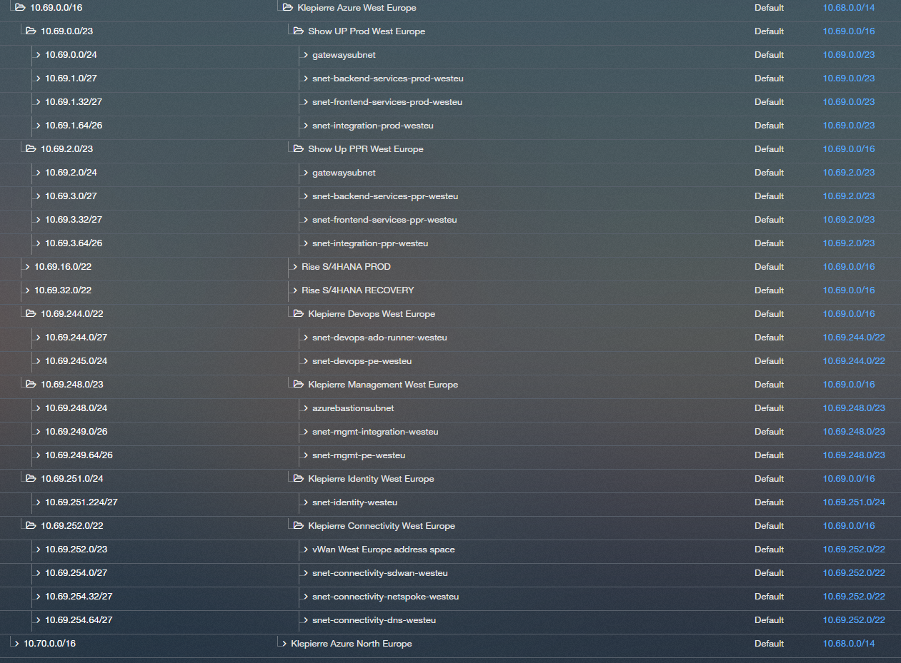

# Connectivity landing zone

## Connectivity requirements

| ID           | Name                                                                                                                                                |
| :----------- | :-------------------------------------------------------------------------------------------------------------------------------------------------- |
| OBS-AZ-CO-01 | Any Klepierre’s site must be able to exchange traffic with any Azure VNET if the routing on Klepierre’s network route traffic through VPN.          |
| OBS-AZ-CO-02 | Any Azure VNET must be able to exchange traffic with any other Azure NET.                                                                           |
| OBS-AZ-CO-03 | Any traffic within Azure will cross at least one network traffic filtering enforcement point.                                                       |
| OBS-AZ-CO-04 | Any traffic exchanged with the public Internet via Azure Internet accesses will cross layer 7 firewall network traffic filtering enforcement point. |

: Connectivity requirements

## Connectivity Schema

The diagram below illustrates the connectivity zone, including connectivity hub and Security VNET as well as its interactions with other zones:

- Landing zones, hosting Private VNET or DMZ VNET, or both.

## Connectivity description

The Klepierre project requires to enable the connection between the on-premises infrastructure and the cloud environment to:

- Enable the connection between services located on the on-premises infrastructure and Azure.

- Enable the monitoring of workload deployed on azure from the Klepierre On Prem solution.

- Enable the access through private endpoint to critical azure resources such as keyvault or storage account.

Connectivity zone will also provide routing and security capabilities to meet project requirements. At the first stage of the project, the
connectivity solution between workload on-premises will be based on a SDWAN connection between Azure and Klepierre on-premises infrastructure. In
the future, Klepierre may choose to move to an MPLS interconnexion to improve the quality of the links between on-premises datacenter and
Azure.

The connectivity solution will leverage Azure Virtual WAN and Secure Virtual Hub (vHub) components.

**Azure Virtual WAN** is a networking service that provides a unified hub-and-spoke architecture for managing connectivity between on-premises sites, branch offices, and Azure resources. It simplifies large-scale branch connectivity, optimizes routing, and centralizes security policies.

**Secure vHub** is a core component of Azure Virtual WAN that integrates advanced security features such as firewall, VPN, and routing policies within a single, managed hub. This ensures secure and efficient traffic flow between on-premises networks and Azure resources.

At the beginning of the project, only a single Virtual WAN will be deployed to establish connectivity. However, the long-term goal is to expand to a multi-regional architecture, enabling resilient and optimized connections across multiple Azure regions as the project scales.

The Solution 3 describe in the following article will be the foundation of our architecture:

- [https://techcommunity.microsoft.com/blog/azurenetworkingblog/combining-firewall-protection-and-sd-wan-connectivity-in-azure-virtual-wan/4394880](https://techcommunity.microsoft.com/blog/azurenetworkingblog/combining-firewall-protection-and-sd-wan-connectivity-in-azure-virtual-wan/4394880)

### Selected Solution: Meraki SD-WAN

Klepierre has chosen Cisco Meraki SD-WAN as the primary solution for connecting its on-premises infrastructure to Azure. Meraki SD-WAN simplifies and secures the connectivity between branch offices, data centers, and cloud environments by dynamically routing traffic over multiple WAN links based on real-time performance.

#### How Meraki SD-WAN Works on Azure

In Azure, Meraki SD-WAN is typically deployed using virtual appliances (vMX) within a dedicated virtual network. These vMX appliances establish secure, encrypted tunnels between the on-premises Meraki devices and Azure, enabling seamless and reliable connectivity. The SD-WAN solution continuously monitors link quality and automatically selects the best path for each application, ensuring optimal performance and uptime. This approach also allows centralized management, policy enforcement, and visibility across the entire network from the Meraki dashboard.

By leveraging Meraki SD-WAN, Klepierre benefits from simplified network operations, enhanced security, and improved application performance for workloads hosted in Azure.

## Global IP Configuration

The following grid display the IP plan for the azure landing zones. Klepierre IT Teams dedicate ad /16 network for the project. That space must be split to meet the project
requirements and to accept future landing zone to be deployed. The address space is divided in two main zones, one for each azure region even if at the
beginning of the project only one region will be used.

The first /21 network is dedicated to core landing zone network needs in each azure zone. The rest of the range will be allocated to application landing zones.
The grid below displays the network plan for core landing zones and Api landing zones (production an pre-production landing zones).

As shown in the previous figures some subnets will be added to IP plan to meet the project requirements.

| **CIDR**         | **Name**                           | **Type** | **Parent CIDR** | **Region**   | **Owner** | **Landing Zone** |
| ---------------- | :---------------------- | -------- | --------------- | ------------ | --------- | ---------------- |
| 10.68.0.0/14     | Klepierre IP Plan                  | Default  | /               | /            | Klepierre |                  |
| 10.69.0.0/16     | Klepierre Azure West Europe        | Default  | 10.68.0.0/14    | West Europe  | Klepierre | Application      |
| 10.69.0.0/23     | Show UP Prod West Europe           | Default  | 10.69.0.0/16    | West Europe  | Klepierre | Application      |
| 10.69.0.0/24     | gatewaysubnet                      | Default  | 10.69.0.0/23    | West Europe  | Klepierre | Application      |
| 10.69.1.0/27     | snet-backend-services-prod-westeu  | Default  | 10.69.0.0/23    | West Europe  | Klepierre | Application      |
| 10.69.1.32/27    | snet-frontend-services-prod-westeu | Default  | 10.69.0.0/23    | West Europe  | Klepierre | Application      |
| 10.69.1.64/26    | snet-integration-prod-westeu       | Default  | 10.69.0.0/23    | West Europe  | Klepierre | Application      |
| 10.69.2.0/23     | Show Up PPR West Europe            | Default  | 10.69.0.0/16    | West Europe  | Klepierre | Application      |
| 10.69.2.0/24     | gatewaysubnet                      | Default  | 10.69.2.0/23    | West Europe  | Klepierre | Application      |
| 10.69.3.0/27     | snet-backend-services-ppr-westeu   | Default  | 10.69.2.0/23    | West Europe  | Klepierre | Application      |
| 10.69.3.32/27    | snet-frontend-services-ppr-westeu  | Default  | 10.69.2.0/23    | West Europe  | Klepierre | Application      |
| 10.69.3.64/26    | snet-integration-ppr-westeu        | Default  | 10.69.2.0/23    | West Europe  | Klepierre | Application      |
| 10.69.16.0/22    | Rise S/4HANA PROD                  | Default  | 10.69.0.0/16    | West Europe  | Klepierre | Application      |
| 10.69.32.0/22    | Rise S/4HANA RECOVERY              | Default  | 10.69.0.0/16    | West Europe  | Klepierre | Application      |
| 10.69.244.0/22   | Klepierre Devops West Europe       | Default  | 10.69.0.0/16    | West Europe  | Klepierre | DevOps           |
| 10.69.244.0/27   | snet-devops-ado-runner-westeu      | Default  | 10.69.244.0/22  | West Europe  | Klepierre | DevOps           |
| 10.69.245.0/24   | snet-devops-pe-westeu              | Default  | 10.69.244.0/22  | West Europe  | Klepierre | DevOps           |
| 10.69.248.0/23   | Klepierre Management West Europe   | Default  | 10.69.0.0/16    | West Europe  | Klepierre | Management       |
| 10.69.248.0/24   | azurebastionsubnet                 | Default  | 10.69.248.0/23  | West Europe  | Klepierre | Management       |
| 10.69.249.0/26   | snet-mgmt-integration-westeu       | Default  | 10.69.248.0/23  | West Europe  | Klepierre | Management       |
| 10.69.249.64/26  | snet-mgmt-pe-westeu                | Default  | 10.69.248.0/23  | West Europe  | Klepierre | Management       |
| 10.69.251.0/24   | Klepierre Identity West Europe     | Default  | 10.69.0.0/16    | West Europe  | Klepierre | Identity         |
| 10.69.251.224/27 | snet-identity-westeu               | Default  | 10.69.251.0/24  | West Europe  | Klepierre | Identity         |
| 10.69.252.0/22   | Klepierre Connectivity West Europe | Default  | 10.69.0.0/16    | West Europe  | Klepierre | Connectivity     |
| 10.69.252.0/23   | vWan West Europe address space     | Default  | 10.69.252.0/22  | West Europe  | Klepierre | Connectivity     |
| 10.69.254.0/27   | snet-connectivity-sdwan-westeu     | Default  | 10.69.252.0/22  | West Europe  | Klepierre | Connectivity     |
| 10.69.254.32/27  | snet-connectivity-netspoke-westeu  | Default  | 10.69.252.0/22  | West Europe  | Klepierre | Connectivity     |
| 10.69.254.64/27  | snet-connectivity-dns-westeu       | Default  | 10.69.252.0/22  | West Europe  | Klepierre | Connectivity     |
| 10.70.0.0/16     | Klepierre Azure North Europe       | Default  | 10.68.0.0/14    | North Europe | Klepierre | Future needs     |

: Subnet IP Plan

# IP Plan Organization

The IP plan is structured to accommodate two Azure regions: **North Europe** and **West Europe**. Each region is assigned its own dedicated IP range to ensure clear separation and efficient management of resources.

- **North Europe**: The IP range for this region is allocated under `10.70.0.0/16`.
- **West Europe**: The IP range for this region is allocated under `10.69.0.0/16`.

Within each region's IP range, the address space is divided into two main categories:

1. **Application Landing Zones**: These zones are located at the beginning of the IP plan for each region. They are designed to host application-specific resources, such as production and pre-production environments. For example:
   - `10.69.0.0/23` for **Show UP Prod West Europe**.
   - `10.69.2.0/23` for **Show Up PPR West Europe**.

2. **Platform Zones**: These zones are located at the end of the IP plan for each region. They are reserved for core infrastructure components, including **Identity**, **Management**, **Connectivity**, and **DevOps**. For example:
   - `10.69.244.0/22` for **Klepierre DevOps West Europe**.
   - `10.69.248.0/23` for **Klepierre Management West Europe**.
   - `10.69.251.0/24` for **Klepierre Identity West Europe**.
   - `10.69.252.0/22` for **Klepierre Connectivity West Europe**.

This organization ensures that the platform zones, which provide foundational services, are clearly separated from the application landing zones, which host specific workloads. It also allows for future scalability and efficient allocation of IP ranges as the project evolves.

## Routing Tables and firewall strategy

To meet project requirements, only one routing scenario will be activated where all traffic will be routed through the Checkpoint to enable the connection between Klepierre on-premises datacenter and various virtual network deployed on Azure.

The below table illustrates routing scenarios. It reads as, for example, traffic initiated from Klepierre on-premises (line \#2, column \#1) going to VNET Devops (line#1, column \#6)
will be routed via Checkpoint Firewall.

|                   | To   | Klepierre On Prem | VNET Connectivty | VNET Identity | VNET devops | VNET mgmt | VNET Showup prod | VNET Showup pre prod |
| :---------------- | :--- | :---------------- | :--------------- | :------------ | :---------- | :-------- | :--------------- | :------------------- |
| from              |      |                   |                  |               |             |           |                  |                      |
| Klepierre On Prem |      |                   | Firewall         | Firewall      | Firewall    | Firewall  | Firewall         | Firewall             |
| VNET Connectivty  |      | Firewall          |                  | Firewall      | Firewall    | Firewall  | Firewall         | Firewall             |
| VNET Identity     |      | Firewall          | Firewall         |               | Firewall    | Firewall  | Firewall         | Firewall             |
| VNET devops       |      | Firewall          | Firewall         | Firewall      |             | Firewall  | Firewall         | Firewall             |
| VNET mgmt         |      | Firewall          | Firewall         | Firewall      | Firewall    |           | Firewall         | Firewall             |
| VNET Showup prod  |      | Firewall          | Firewall         | Firewall      | Firewall    | Firewall  |                  | Firewall             |
| VNET Showup pre   |      | Firewall          | Firewall         | Firewall      | Firewall    | Firewall  | Firewall         |                      |

: Routing Scenario

## DNS Strategy

Klepierre’s domain controllers on-premises will carry on premise DNS role and are responsible for the Klepierre on prem domain DNS Zone (such as interne.klepierre.com). Azure DNS service will
be responsible for handling DNS traffic for all private DNS zones deployed on azure (for databases, cloud storage, azure websites, …). The private dns forwarder service will be configured in the connectivity zone w to forward DNS Query to the on prem Klepierre DNS server when the query is related to the “.klepierre.com” zone
or the azure DNS server otherwise. All vnet deployed on azure are configured with a custom DNS server that point to private dns server service. That way all services deployed on azure
are able to get information about the “.klepierre.com” zone and for all users presents in the on prem network are able to reach the private endpoint of azure services.

More information can be found at:

- [https://learn.microsoft.com/en-us/azure/architecture/example-scenario/networking/azure-DNS-private-resolver](https://learn.microsoft.com/en-us/azure/architecture/example-scenario/networking/azure-dns-private-resolver).

On prem, based on domain configuration, some Conditionnal Resolver must be implemented to resolve the Azure Assets (such as private endpoint, …).

## Netskope Technology for VPN Connectivity

Netskope is a cloud security platform that provides advanced solutions for secure access to cloud services, applications, and data. It includes features such as Secure Web Gateway (SWG), Cloud Access Security Broker (CASB), and Zero Trust Network Access (ZTNA).

In the context of VPN connectivity, Netskope enables secure and optimized access to Azure resources by leveraging its ZTNA capabilities. This approach replaces traditional VPNs with a more modern, scalable solution that ensures secure access to applications and data based on user identity, device posture, and contextual policies.

### Key Features of Netskope for VPN Connectivity

1. **Zero Trust Access**: Netskope enforces granular access controls, ensuring that users and devices can only access authorized resources.
2. **Cloud-Native Architecture**: Netskope integrates seamlessly with Azure, providing secure connectivity without the need for complex on-premises infrastructure.
3. **Performance Optimization**: Netskope routes traffic intelligently, reducing latency and improving user experience for accessing Azure-hosted applications.
4. **Comprehensive Security**: Netskope inspects traffic for threats, ensuring that data exchanged between on-premises and Azure remains secure.

By leveraging Netskope technology, Klepierre can ensure secure, scalable, and efficient connectivity between its on-premises infrastructure and Azure resources, meeting the project’s security and performance requirements.

### Deployment of the Netskope Solution

The Netskope solution will not be deployed using Terraform, as the deployment is expected to remain static after the initial setup. Instead, the Orange Business Team will manually deploy two virtual machines (VMs) to implement the solution.

If the Netskope solution becomes available on the Azure Marketplace, it could be a good option to deploy it directly from there. This approach would simplify the provisioning process and ensure easier management of the solution within the Azure

## Meraki Technology for SD-WAN Connectivity

### What is SD-WAN Technology?

**Software-Defined Wide Area Network (SD-WAN)** is a modern networking technology that simplifies the management and operation of a wide area network (WAN). It decouples the networking hardware from its control mechanism, enabling organizations to securely connect users to applications by intelligently routing traffic across multiple WAN connections (such as MPLS, broadband, and LTE). This routing is based on business policies, application requirements, and real-time network conditions.

**Key benefits of SD-WAN include:**

- Centralized management and visibility
- Improved application performance and reliability
- Enhanced security through encryption and segmentation
- Cost savings by leveraging multiple, cost-effective connectivity options

### Meraki SD-WAN Technology

**Cisco Meraki** is a leading provider of cloud-managed networking solutions, including SD-WAN. Meraki’s SD-WAN technology is integrated into its MX series security and SD-WAN appliances, which are managed through the Meraki Dashboard—a centralized, cloud-based interface.

**Key features of Meraki SD-WAN:**

- **Cloud-Based Management:** Simplifies deployment, monitoring, and troubleshooting through an intuitive web dashboard.
- **Intelligent Path Selection:** Automatically routes traffic over the best available link based on application type, performance, and policies.
- **Integrated Security:** Provides advanced security features such as firewall, intrusion prevention, and content filtering.
- **Scalability:** Easily scales from small branch offices to large enterprise networks.

By using Meraki SD-WAN, Klepierre can achieve reliable, secure, and optimized connectivity between on-premises sites and cloud resources like Azure, while reducing operational complexity.

Klepierre is already using that solution to connect all it's point of presence in Europe and the project aims to extends that network to Azure Landing Zones.

### Deployement Schema

You can find here a schema that present how the SDWan Meraki can be deployed on Azure and interconnected to the vWan solution:

More information around the deployment strategy can be found here:

- [https://documentation.meraki.com/MX/Deployment_Guides/vMX_and_Azure_vWAN](https://documentation.meraki.com/MX/Deployment_Guides/vMX_and_Azure_vWAN).

### SDWan Deployment

Similar to the Netskope solution, the SD-WAN deployment will also be performed manually. The Orange Business Team will handle the setup of the SD-WAN solution to ensure proper integration with the on-premises infrastructure and Azure.

Manual deployment is chosen for both solutions as they are expected to remain static after the initial setup, minimizing the need for automation through Terraform. This approach ensures flexibility and control during the initial configuration phase.
