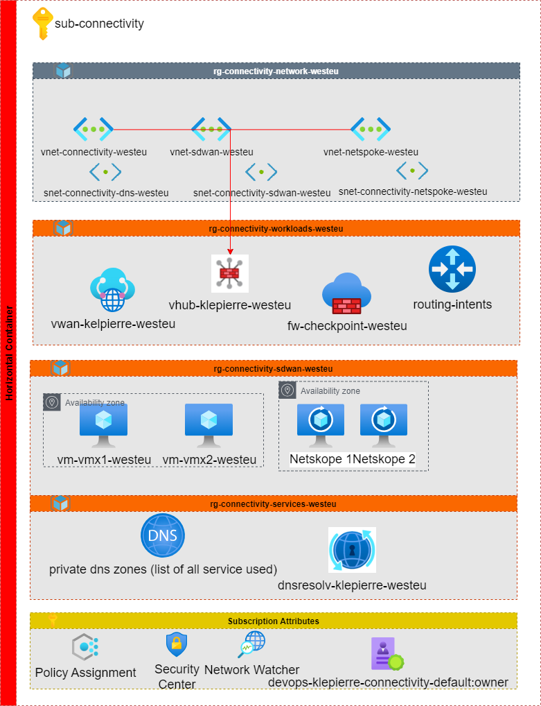
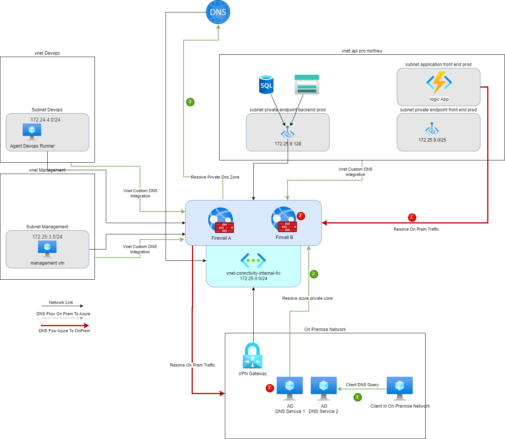

# Connectivity landing zone

## Connectivity requirements

| ID                              | Name                                                                                                                                |
| :------------------------------ | :---------------------------------------------------------------------------------------------------------------------------------- |
| OCB-AZ-CO-01                    | Any April’s site must be able to exchange traffic with any Azure VNET if the routing on April’s network route traffic through VPN.|
| OCB-AZ-CO-02                    | Any Azure VNET must be able to exchange traffic with any other Azure NET.                                                           |
| OCB-AZ-CO-03                    | Any traffic within Azure will cross at least one network traffic filtering enforcement point.                                       |
| OCB-AZ-CO-04                    | Any traffic exchanged with the public Internet via Azure Internet accesses will cross layer 7 firewall network traffic filtering enforcement point. |

: Connectivity requirements

## Connectivity Schema

The diagram below illustrates the connectivity zone, including connectivity hub and Security VNET as well as its interactions with other zones:

- Landing zones, hosting Private VNET or DMZ VNET, or both.

## Connectivity description

The April project requires to enable the connection between the on-premises infrastructure and the cloud environment to:

- Enable the connection between services located on the on-premises infrastructure and Azure.

- Enable the monitoring of workload deployed on azure from the April On Prem solution.

- Enable the access through private endpoint to critical azure resources such as keyvault or storage account.

Connectivity zone will also provide routing and security capabilities to meet project requirements. At the first stage of the project, the
connectivity solution between workload on-premises will be based on a VPN connection between Azure and April on-premises infrastructure. In
the future, April may choose to move to an MPLS interconnexion to improve the quality of the links between on-premises datacenter and
Azure. The April project will conduct benchmark and performance tests while the initial phase of the project that will define their needs in
term of bandwidth and QoS regarding this on premises connectivity technology.

To meet the project’s security requirements and the April operating model and investment strategy, April choose to leverage on the
Azure VWan solution to enable the interconnection of it’s on premises infrastructure to azure in order to deploy the Hub and Spoke newtwork topology.

## Global IP Configuration

The IP Plan is defined in the APRIL IPAM Solution located here: [https://phpipam.april.interne.fr/](https://phpipam.april.interne.fr/)

## Network topology and peering strategy

### Network topology

The network topology is based on a Hub and Spoke model, where the connectivity zone will act as the hub for all other zones. The connectivity zone will host the workload connectivity and security services, such as the Azure VWan, Azure Firewall, and the Bind9 DNS servers. The connectivity zone will also provide routing capabilities to enable communication between the on-premises infrastructure and the Azure virtual networks.

### Routing Tables

To meet project requirements, only one routing scenario will be activated where all traffic will be routed through the Fortigate to enable the connection
between April on-premises datacenter and various virtual network deployed on Azure.

The below table illustrates routing scenarios. It reads as, for example, traffic initiated from April on-premises (line \#2, column \#1) going to VNET Devops (line#1, column \#6)
will be routed via Fortigate Firewall.

|                      | To  | April On Prem  | VNET Connectivty | VNET Datascience HPR | VNET devops    | VNET mgmt      | VNET Identity  | VNET Data HPR  | VNET Data PRO  |
| :------------------- | :-- | :------------- | :--------------- | :------------------- | :------------- | :------------- | :------------- | :------------- | :------------- |
| from                 |     |                |                  |                      |                |                |                |                |                |
| April On Prem        |     |                | Azure Firewall   | Azure Firewall       | Azure Firewall | Azure Firewall | Azure Firewall | Azure Firewall | Azure Firewall |
| VNET Connectivty     |     | Azure Firewall |                  | Azure Firewall       | Azure Firewall | Azure Firewall | Azure Firewall | Azure Firewall | Azure Firewall |
| VNET Datascience HPR |     | Azure Firewall | Azure Firewall   |                      | Azure Firewall | Azure Firewall | Azure Firewall | Azure Firewall | Azure Firewall |
| VNET devops          |     | Azure Firewall | Azure Firewall   | Azure Firewall       |                | Azure Firewall | Azure Firewall | Azure Firewall | Azure Firewall |
| VNET mgmt            |     | Azure Firewall | Azure Firewall   | Azure Firewall       | Azure Firewall |                | Azure Firewall | Azure Firewall | Azure Firewall |
| VNET Identity        |     | Azure Firewall | Azure Firewall   | Azure Firewall       | Azure Firewall | Azure Firewall |                | Azure Firewall | Azure Firewall |
| VNET Data  PPR       |     | Azure Firewall | Azure Firewall   | Azure Firewall       | Azure Firewall | Azure Firewall | Azure Firewall |                | Azure Firewall |
| VNET Data  PRO       |     | Azure Firewall | Azure Firewall   | Azure Firewall       | Azure Firewall | Azure Firewall | Azure Firewall | Azure Firewall |                |

:Routing Scenario

## DNS Strategy

April’s domain controllers on-premises will carry on premise DNS role and are responsible for the April on prem domain DNS Zone (such as **.april.interne.fr**). Azure DNS service will
be responsible for handling DNS traffic for all private DNS zones deployed on azure (for databases, cloud storage, azure websites, …). The Bind9 servers configured with DNS Forwarder option, located in the connectivity zone will be used to forward DNS Query to the on prem April DNS server when the query is related to the **.april.interne.fr** zone
or the azure DNS server otherwise. All vnet deployed on azure are configured with a custom DNS server that point to the Bind9 servers. That way all services deployed on azure
are able to get information about the **.april.interne.fr** zone and for all users presents in the on prem network are able to reach the private endpoint of azure services.

A dedicated subdomain will be delegated to the datascience zone : **.data.interne.cloud.april**. This subdomain will be an azure private DNS zone in connectivity zone, mannaged by the datascience LZ. A wildcard internal certificate will be provided to sign all internal endpoints exposed in this zone.
DNS trafic comming from on premise will be forwarded to Azure Bind9 servers for this sub domain.

More information can be found at
[https://learn.microsoft.com/en-us/azure/architecture/example-scenario/networking/azure-DNS-private-resolver](https://learn.microsoft.com/en-us/azure/architecture/example-scenario/networking/azure-dns-private-resolver).

On prem, based on domain configuration, some Conditionnal Resolver must be implemented to resolve the Azure Assets (such as private endpoint,…).

## IP Plan

The table below displays the IP plan for the connectivity zone. The address space is divided into 4 main zones, one for each node pool of the aks cluster, and one
for the private link integration.

| Landing Zone      | Address Space      | Purpose                        |
| :---------------- | :----------------- | :----------------------------- |
| Data HPR          | 172.16.38.0/24     | Hosting high performance data workloads (outside production) |
| Data PPR          | 172.16.39.0/24     | Hosting high performance data workloads (pre-production) |
| Data PRO          | 172.16.40.0/24     | Hosting high performance data workloads (production)     |

: Datascience HPR and Data PRO Landing Zone Networks
