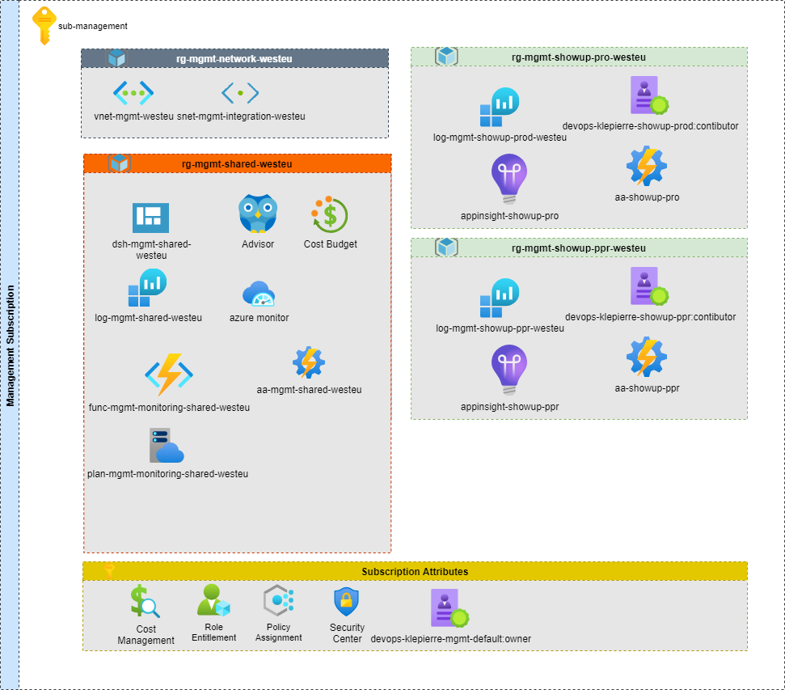
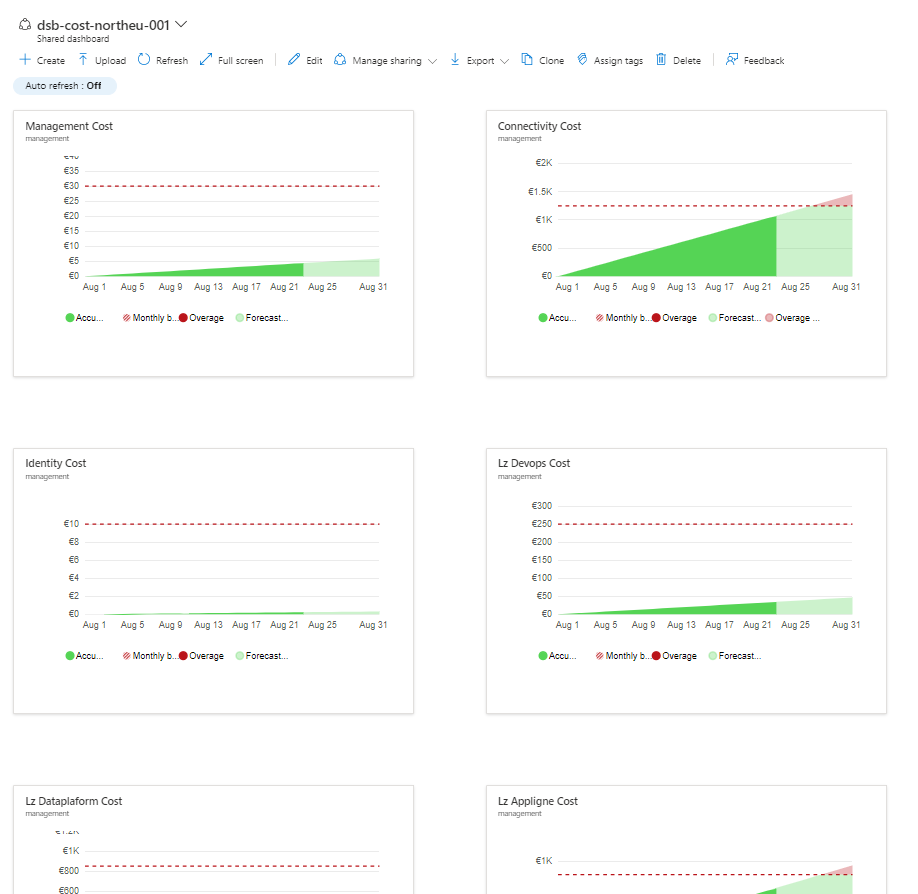
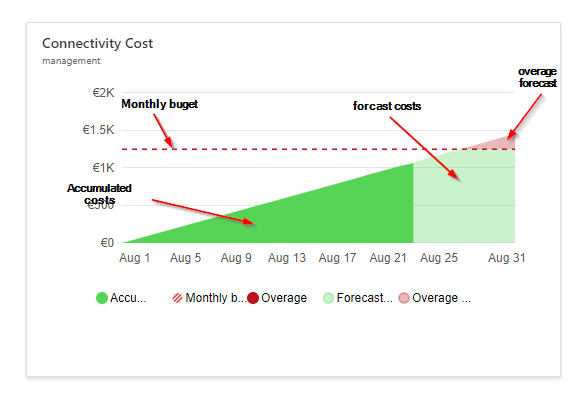
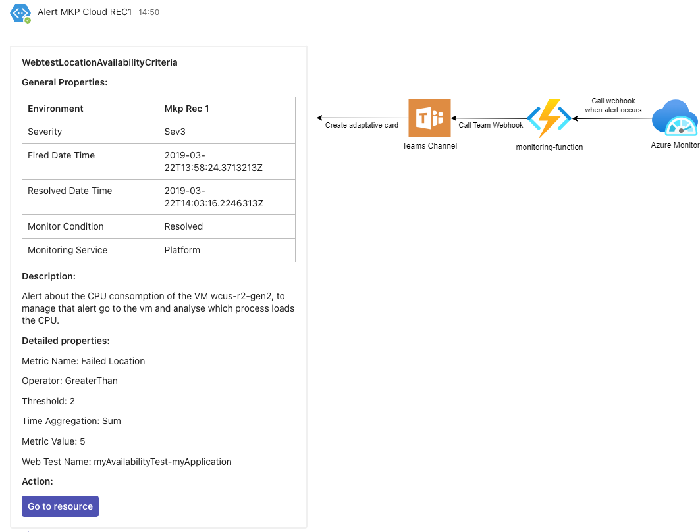

# Management landing zone

## Management

### Management Requirements

| ID                              | Name                                                   |
| :-------------- | :--------------------------------------------------------------------- |
| OBS-AZ-MGT-01                   | Klepierre must be able to be alerted in case of defect in its infrastructure in monitoring solution used for managing all on-premises IT resources |
| OBS-AZ-MGT-002                  | Azure Monitor is the only monitoring solution in Azure. No external or agent must be deployed to monitor the tenant                             |
| OBS-AZ-MGT-003                  | All log of the platform must be located in the same log analytic workspace or at least in only one log analytic workspace per region            |
| OBS-AZ-MGT-004                  | Klepierre must be able to have a synthetic view of all Azure costs.                                                                                |
| OBS-AZ-MGT-005                  | Klepierre must be alerted if Azure costs exceed limits. Each limit can be specified as a parameter                                                 |
| OBS-AZ-MGT-006                  | Klepierre must be able to connect to all Azure resources when they work remotely to manage them. For example administrator can reach Azure SQL database and open database schema to edit data when a production incident is declared. |

: Management Requirements

### Management Schema

The following figure presents the organization of Azure resources used in the management landing zone.

### Management Description

The management landing zone aims to enable Klepierre to:

- Manage their Azure resources (Administration tasks, configurations,
    automation for example)
- Centralize the platform logs and consult them.
- Audit its infrastructure in terms of security.
- Access the Azure advisor to detect misconfiguration.
- Monitor the infrastructure.
- Monitor the costs of the Azure platform.

## Dashboarding

### Dashboarding requirements

| ID             | Name                                                                |
| :------------- | :------------------------------------------------------------------ |
| OCB-AZ-MGT-004 | Klepierre must be able to have a synthetic view of all Azure costs. |

: Dashboarding Requierements

### Dashboard Presentation

The figure below presents the dashboard that will be deployed to follow the costs per subscription of your Azure infrastructure.

### Dashboard Description

With that dashboard, you can follow:

- Accumulated costs since the beginning of the month
- The monthly budget
- The overage
- The forecast cost.
- The overage forecast

### New Resources in the Management Landing Zone

The managment landing zone will hold all ressources dedicated to the management accross the Klepierre tenant. The platform zone management
ressources will be deployed in the shared ressource group and for each application / environment a ressource group will be created.

That way all the costs related to the azure managment activities will be centralized in the same subscription but Klepierre will have the ability
to give access to users to each resource group with a high level of granularity

### About the monitoring

Klepierre currently uses Centreon to monitor their on-premises resources. To improve efficiency and maintain a unified monitoring approach, it is important to extend Centreon’s capabilities to also monitor Azure assets. This ensures that all infrastructure—both on-premises and in the cloud—is supervised through a single tool.

To provide rapid incident response, alerts should be sent directly to Microsoft Teams, giving the operations team quick visibility into issues.

To achieve this, we will deploy an Azure Function and configure an Azure Monitor Action Group:

- **Azure Monitor Action Group**: An action group is a collection of notification and automation actions that Azure Monitor can trigger when an alert is fired. Actions can include sending emails, SMS, calling webhooks, or running Azure Functions.
- **Azure Function**: This serverless function will expose an HTTP endpoint. When an alert is triggered, the action group will call this endpoint. The Azure Function will then forward the alert details to Centreon, allowing Centreon to process and display Azure alerts alongside on-premises alerts.

This setup ensures seamless integration between Azure monitoring and Centreon, and enables fast, centralized alerting through Teams.

The schema bellow present the process of alerts collection to teams and how it is displayed in your channel:

