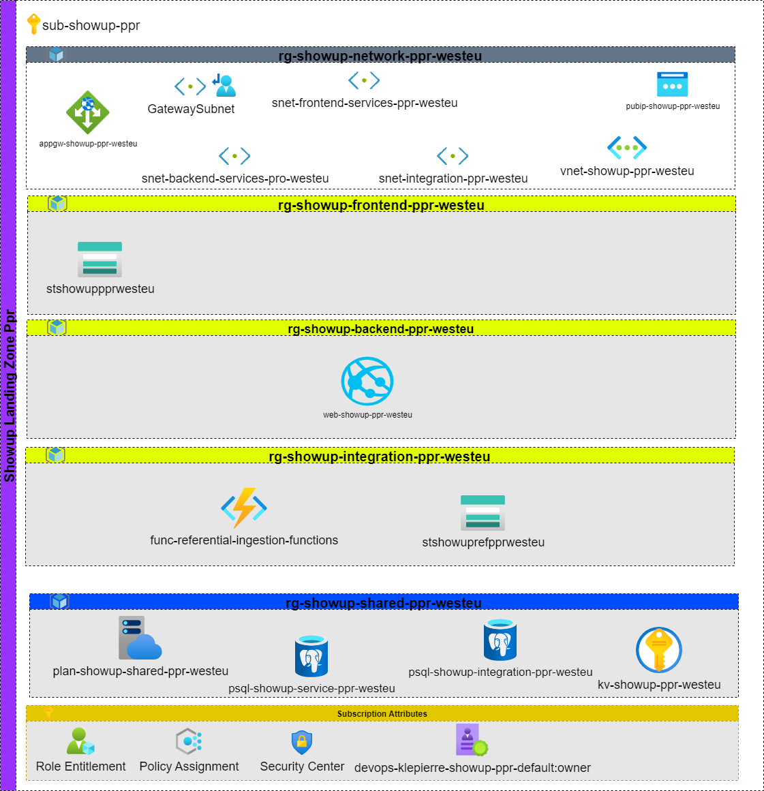

# Showup Pre Production

## Showup Pre Production requirements

| ID               | Name                                                                                                                                                   |
| :--------------- | :-------------------------------------------------------|
| OBS-AZ-SHOWUP-PPR-01 | All Azure resources must be deployed by using automation tools such as Terraform, Azure Resource Manager or any scripting solution that uses Azure API |
| OBS-AZ-SHOWUP-PPR-02 | The source code used to deploy the project must be managed in SCM tool such as Git                                                                     |
| OBS-AZ-SHOWUP-PPR-03 | Each deployment must be launched through a CI/CD process that check the code quality and execute release pipelines                                     |
| OBS-AZ-SHOWUP-PPR-04 | Klepierre Azure Dev Ops solution must be used as the application management live cycle tools of the project.                                           |

:Showup Production Zone Requirements

## Schema

## Application Software Architecture

The application software architecture is not strictly within the scope of this project, as it falls under the responsibility of the development team. Nevertheless, some changes have been made
to the Azure infrastructure based on proposals from the development team. All resources eligible to use private endpoints will be deployed using this technology to enhance
security and connectivity. Additionally, the Azure Front Door solution will not be deployed; instead, an Azure Application Gateway will be utilized to manage application traffic.

## Azure Front Door vs Application Gateway

**Azure Front Door** and **Azure Application Gateway** are both services designed to manage and optimize web traffic, but they serve different purposes and are suited for different scenarios.

### Azure Front Door

Azure Front Door is a global load balancing and content delivery network (CDN) service. It is designed for applications that span multiple regions and require high availability and performance across the globe. Key features include:

- Global traffic routing based on latency, ensuring users are directed to the nearest endpoint.
- Built-in CDN capabilities for caching and accelerating content delivery.
- Layer 7 routing for HTTP/HTTPS traffic.
- Integration with Azure Web Application Firewall (WAF) for security.

### Azure Application Gateway

Azure Application Gateway is a regional Layer 7 load balancer designed for managing web traffic within a specific region. It provides more granular control over traffic routing and network integration. Key features include:

- Regional traffic management for applications hosted within a single Azure region.
- Support for private endpoints and integration with virtual networks.
- Advanced traffic routing capabilities, such as URL-based routing and session affinity.
- Integration with Azure Web Application Firewall (WAF) for security.

### Why Use Application Gateway for This Project?

Our project is a regional project, focused on resources and applications deployed within a single Azure region. As such, Azure Application Gateway is preferred over Azure Front Door because:

- It provides more granular network integration, allowing better control over traffic routing within the region.
- It supports private endpoints, enhancing security and connectivity for resources deployed in the region.
- The global traffic management capabilities of Azure Front Door are not required for this project, as it does not span multiple regions.

By using Azure Application Gateway, we ensure that the network architecture aligns with the regional scope of the project while maintaining robust security and traffic management capabilities.
