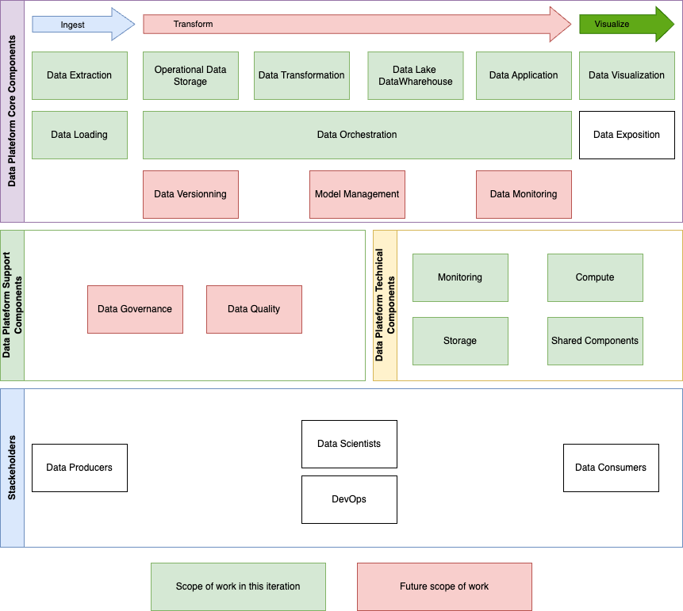
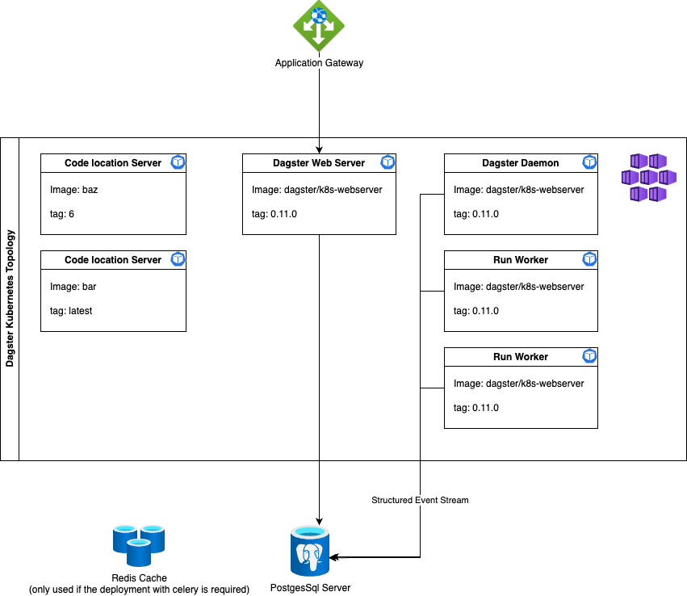
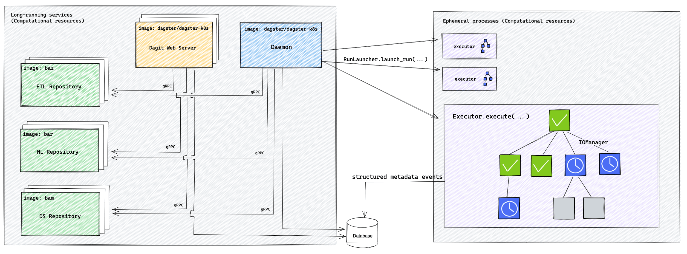
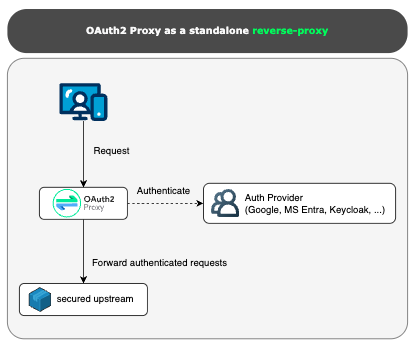
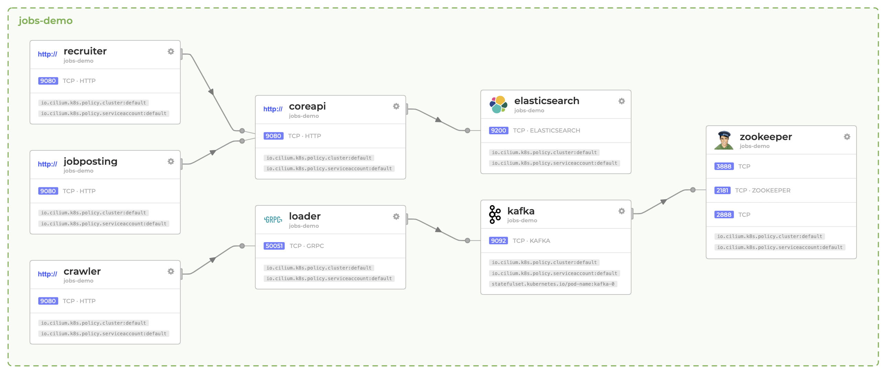
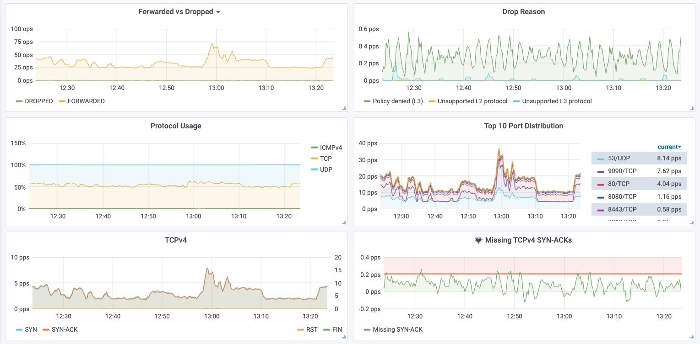
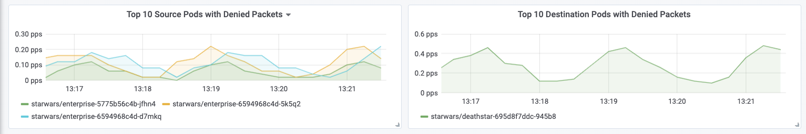
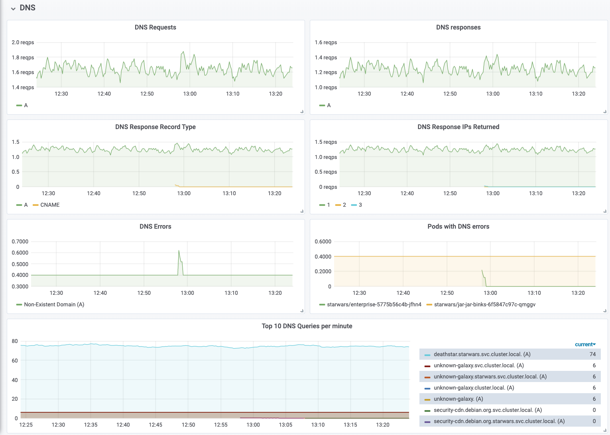

# Datascience technical implementation

## Functionnal scope of work

Due to planning constaints, the whole datascience platform will not be implemented in this iteration. The following functionnal schema outlines which component will be implemented in this iteration.



## Technical implementation map

| Functional Element            | Main Hosting Target   | Model                      |
| :---------------------------- | :-------------------- | :------------------------- |
| Data sources                  | Snowflake             | PaaS, SaaS                 |
| Data Extraction               | DBT                   | Library versioned and hosted per application |
| Analytical Data Storage       | Snowflake             | Saas                       |
| Data Transformation           | DBT                   | Library versioned and hosted per application |
| Data Lake                     | Snowflake             | PaaS, SaaS                 |
| Data Applications             | Python                | AKS                        |
| Data Orchestration            | Dagster               | AKS                        |
| Data Versioning               | Git LFS               | AKS                        |
| Model Management              | MLFlow                | Gitlab MLFlow intégration        |
| Data Testing                  | DBT Great Expectation | Great expectations plugin for DBT|
| Data Vizualisation            | Qliksense             | On-premises SaaS           |
| Data Exposition               | Python Flask          | AKS                        |
| Data Governance               | Datahub               | AKS                        |
| Data Quality                  | DataHub               | AKS                        |
| Monitoring                    | Prometheus / Grafana  | SaaS                       |
| Compute                       | AKS                   | PaaS                       |
| Storage (for technical needs) | Azure Storage account | PaaS                       |
| Storage (for business sharing)| Azure Storage account | PaaS                       |
| Shared Component              | Azure                 | PaaS                       |

: Technical implementation map

### AKS deployment

\hfill\break

The following application will be deployed on AKS to support the Data Platform Core Components.

#### Dagster

##### Dasgter purpose

**Dagster** is an orchestrator for data workflows that ensures the seamless operation and management of data pipelines. It facilitates the development, testing, and deployment of data applications, while providing robust tools for monitoring and maintaining data integrity. Dagster's modular architecture allows for flexible integration with various data processing tools, enabling efficient handling of complex data workflows.

##### Dagster Kubernetes tolopolgy



##### Dagster description

###### Code location server

A code location server runs a gRPC server and responds to the Dagster webserver's requests for information, such as:

- List all of the jobs in each code location, or
- What is the dependency structure of job X?
- The user-provided image for the server must contain a code location definition and all of the packages needed to execute within the code location.

Users can have multiple code location servers. A common pattern is for each code location server to correspond to a different code location.

Code location servers can be updated independently from other Dagster components, including the webserver. As a result, updates to code locations can occur without causing downtime to any other code location or the webserver. After updating, if there is an error with any code location, an error is surfaced for that code location within the Dagster UI. All other code locations and the UI will still operate normally.

###### Dagster Webserver

The Dagster webserver communicates with user code deployments via gRPC to fetch information needed to populate the Dagster UI. The webserver doesn't load or execute user-written code, which allows the UI to remain available even when user code contains errors. The webserver frequently checks whether the user code deployment has been updated and if so, fetches the new information.

The webserver can be horizontally scaled by setting the dagsterWebserver.replicaCount field in values.yaml.

By default, the webserver launches runs via the K8sRunLauncher, which creates a new Kubernetes job per run.

###### Dagster Daemon

The daemon periodically checks the runs table in PostgreSQL for runs that are ready to be launched. The daemon also submits runs from schedules and sensors.

The daemon launches runs via the K8sRunLauncher, creating a run worker job with the image specified in the user code deployment.

###### Run worker

The run worker is responsible for executing launched Dagster runs. The run worker uses the same image as the user code deployment at the time the run was submitted. The run worker uses ephemeral compute and completes once the run is finished. Events that occur during the run are written to the database and then displayed in the UI.

Run worker jobs and pods are not automatically deleted so that users are able to inspect results. It's up to the user to periodically delete old jobs and pods.

###### Executor

Each Dagster job specifies an executor that determines how the run worker will execute each step of the job. Different executors offer different levels of isolation and concurrency. Common choices are:

- in_process_executor - All steps run serially in a single process in a single pod
- multiprocess_executor - Multiple processes run in a single pod
- k8s_job_executor - Each step runs in a separate Kubernetes job

Generally, increasing isolation incurs some additional overhead per step (e.g. starting up a new Kubernetes job vs starting a new process within a pod). The executor can be configured

###### Database

An external database (i.e. using a cloud provider's managed database service, like RDS) can be connected, or you can run PostgreSQL on Kubernetes. This database stores run event logs, other metadata, and powers much of the real-time and historical data visible in the UI. To maintain a referenceable history of events, we recommend connecting an external database for most use cases.

As a result, an Azure Postgres database will be deployed in the landing zone as a PaaS service.

###### Security and Multi-tenancy

By default, the open-source version of dagster does offer login or rbac features. To be able to control who acess the platform, we need to implement a authentication proxy in front of the dagster WebUIs, to allow access to scheduling only to allowed user groups.

The multi tenancy is not a base feature as well, so we will need to rely on multiple code locations managed by different gitlab groups to implement our multi tenancy.



##### Dagster Security

The open source version of dagster does not offer rbac and security options. But we want to limit the platform access to authorized users only.

To ensure that, we protect the dagster endpoints behind an Oauth2 Reverse Proxy. We use the following microsoft sponsored open source solution : <https://github.com/oauth2-proxy/oauth2-proxy>

We use the following use case, were all traffic comming on kubernetes API Gateway is handled by the Oauth Reverse Proxy.

The Poxy then call Azure Entra ID to login the user and validate it group memberships before performing the request to the dagster server.



The security aspect reagarding Dagster Assets and content is managed by who can access and contribute to the underlying git repositories. On the company's gitlab plateform.

##### Dagster Multi Tenancy

Within April we want to ensuire that each team/tenant are seperated within each plateforms, and are the sole responsible for their own content.

To ensure that, we plan the followind aproach. In this example we see 2 tenant, be they can be as many as necessary.

A dedicated access group, dagster instance and code location are created for each business data team.

The central group data team has access to all instances.


## Datascience platform technical schema


## Datascience platform resources organization

In this chapter, it is essential to underscore the critical importance of resource organization within the data platform, particularly in terms of resource groups. From a FinOps perspective, thoughtful structuring of resources is paramount for effective cost management and control. Furthermore, defining precise RBAC (Role-Based Access Control) across various components ensures robust security and efficient access management.

We will delineate multiple resource groups to optimize the platform's organization:

- **Networking Resource Group**: This group is dedicated to the networking aspects of the landing zone.

- **Shared Components Resource Group**: This encompasses PaaS resources utilized across different applications, such as PostgreSQL databases and Key Vaults.

- **AKS Resource Group**: All resources related to Azure Kubernetes Service (AKS) will be housed here.

- **Monitoring resource group**: this will aggregate all resources related to the monitoring of the dataplatform

- **Management resource group**: this will aggregate all resources related to the management of the dataplatform (i.e. automation / Finops)

Additionally, adhering to the principle of segregation is vital for Key Vault deployments. A distinct Key Vault will be deployed for each Kubernetes application to ensure that secrets and certificates are not shared across pods, enhancing security. Any secrets not utilized within AKS will be stored in the main Key Vault of the zone.

## Kubernetes deployment strategy

The deployment strategy for Kubernetes applications will be based on the following principles:

- **Namespace per application**: Each application will have its own namespace within AKS to ensure isolation and security.
- **Secrets and ConfigMaps**: Secrets and ConfigMaps will be stored in the respective Key Vault and mounted as volumes in the pods.
- **Resource Quotas**: Resource quotas will be defined for each namespace to prevent resource exhaustion.
- **Network Policies**: Network policies will be implemented to control traffic between pods and enforce security.
- **RBAC**: Role-Based Access Control will be meticulously defined to ensure that only authorized users can access resources.
- **Monitoring and Logging**: Monitoring and logging will be integrated into the applications to track performance and detect anomalies.
- **Deployment Automation**: CI/CD pipelines will be established to automate the deployment process and ensure consistency.
- **Scalability and Availability**: The applications will be designed to scale horizontally and ensure high availability through redundancy.
- **Limit network exposition**: The datascience plateform must not be exposed publicly. The deployment must be done in a private network only and communication with external azure resources must be done by using private endpoint connection.

### Namespace per application

Each application deployed in AKS will have its own namespace to ensure isolation and security. This approach allows for the segregation of resources and the implementation of RBAC policies specific to each application. By defining namespaces for individual applications, we can prevent resource conflicts and enforce access control at a granular level.

### Secrets and ConfigMaps

Secrets and ConfigMaps will be stored in the respective Key Vault and mounted as volumes in the pods. This approach ensures that sensitive information such as passwords, API keys, and certificates are securely stored and accessed by the applications. By leveraging Key Vault integration, we can centralize the management of secrets and reduce the risk of exposure. Only one key vault will be deployed in the shared resource group to store secrets. Eeach secret will be preffix by it's application name to avoid collision inside the key vault.

### Resource Quotas

Resource quotas will be defined for each application to prevent resource exhaustion. By setting limits on CPU, memory, and storage usage, we can ensure that applications do not consume more resources than allocated. This helps to optimize resource utilization and maintain performance across the cluster. Resource quotas will be monitored and adjusted as needed to accommodate changing workload requirements.

### Network Policies

Network policies will be implemented to control traffic between pods and enforce security. By defining rules for inbound and outbound traffic, we can restrict communication between applications and prevent unauthorized access. Network policies will be configured based on the principle of least privilege to minimize the attack surface and protect sensitive data. By implementing network policies, we can enhance the security posture of the applications running in AKS.

The deployment of Network Policies will be done in phase 2 of the project after the initial deployment of the datascience platform to reduce the cognitive load on the build team.

### RBAC

Role-Based Access Control will be meticulously defined to ensure that only authorized users can access resources. RBAC policies will be configured at the namespace level to govern user permissions and restrict access to sensitive data. By assigning roles and permissions based on user roles, we can enforce security best practices and prevent unauthorized actions. RBAC will be integrated with Azure Active Directory to manage user authentication and authorization.

Additionally, an identity will be assigned to each pod, allowing us to assign permissions for applications to access Azure resources, enhancing security and control over resource access.

for more information on the identity managment with AKS you can refer to [https://learn.microsoft.com/en-us/azure/aks/workload-identity-overview?tabs=python](https://learn.microsoft.com/en-us/azure/aks/workload-identity-overview?tabs=python).

### Monitoring and loging

We will link the Log Analytics workspace deployed in the management subscription to monitor the activity on the cluster. Additionally, we will use Grafana as a service and Prometheus as a service for comprehensive monitoring.

Grafana is an open-source platform for monitoring and observability. It provides a powerful and flexible dashboard for visualizing metrics from various data sources, including Prometheus. Grafana allows us to create custom dashboards to monitor the health and performance of our applications and infrastructure.

Prometheus is an open-source systems monitoring and alerting toolkit. It collects and stores metrics as time series data, providing a powerful query language (PromQL) to analyze this data. Prometheus is designed for reliability and scalability, making it ideal for monitoring dynamic cloud environments like AKS.

By integrating Grafana and Prometheus, we can create detailed visualizations and set up alerts to proactively manage the cluster. Alerts can be configured in Prometheus to notify us when specific conditions are met, such as high CPU usage or memory consumption. These alerts can be sent to various notification channels, including email or Microsoft Teams, ensuring that we are promptly informed of any issues that require attention. Those alerts will also be sent to the April Monitoring Team to ensure the full monitoring of the platform.

For more information please refer to this link:[https://learn.microsoft.com/en-us/azure/azure-monitor/containers/prometheus-metrics-scrape-crd](https://learn.microsoft.com/en-us/azure/azure-monitor/containers/prometheus-metrics-scrape-crd).

### Deployment Automation

CI/CD pipelines will be established to automate the deployment process and ensure consistency. By using April GitLab tool, we can define workflows to build, test, and deploy applications to AKS. CI/CD pipelines enable us to automate repetitive tasks, reduce manual errors, and accelerate the release cycle. By integrating CI/CD pipelines into the development process, we can streamline the deployment of applications and maintain a high level of quality.

Various stage of deployment will be defined:

|     stage      | TF Project     |description                | responsability | main tools       |
| :------------: |:---------------|:------------------------- | -------------- | ---------------- |
| Infrastructure | infra-hpr      |Deployment of the azure ressources      | Data Team      | Terraform        |
|   Middleware   | middleware-hpr |Deployment of middleware (i.e. dagster) | Data Team      | Terraform + Helm |
|  Application   | apps-hpr       |Deployment of Business App              | Business Team  | Terraform + Helm |

: Kubernetes deployment stages

For each stage dedicated pipelines and git repositories will be created to ensure the separation of concerns and the security of the platform.

## Kubernetes node pool configuration

The AKS cluster will be configured with multiple node pools to optimize resource allocation and performance. Each node pool will be tailored to specific workload requirements, ensuring that applications run efficiently and securely. The following node pools will be defined:

| Node Pool Name | Node Size       | Node Count | Purpose                |
| :------------- | --------------- | :--------: | ---------------------- |
| Default        | Standard_DS2_v2 |     3      | Low perf applications  |
| HigtLoad       | Standard_DS8_v2 |     2      | High perf applications |
| GitLabRunners  | Standard_DS2_v2 |     4      | Gitlab Runners         |

: Kubernetes node pool configuration

## Kubernetes Network consideration

### CNI Cilium for AKS Cluster Deployment

We will use CNI (Container Network Interface) Cilium to deploy the AKS Cluster.

#### What is a CNI?

A Container Network Interface (CNI) is a specification and a set of libraries for configuring network interfaces in Linux containers. It is responsible for the network connectivity of containers and provides the necessary infrastructure to manage container networking. CNIs enable the creation, configuration, and management of network resources for containers, ensuring seamless communication within the cluster.

#### Benefits of Cilium

Cilium is an open-source CNI that provides advanced networking, observability, and security for containerized applications. It leverages eBPF (extended Berkeley Packet Filter) technology to dynamically insert networking and security control logic into the Linux kernel. The benefits of using Cilium include:

- **High Performance**: Cilium's use of eBPF allows for high-performance networking with low latency and minimal overhead.
- **Security**: Cilium provides fine-grained security policies, enabling micro-segmentation and zero-trust networking within the cluster.
- **Scalability**: Cilium is designed to scale with large Kubernetes clusters, providing efficient and reliable networking for thousands of nodes and pods.
- **Observability**: Cilium offers deep visibility into network traffic, allowing for detailed monitoring and troubleshooting of network issues.
- **Flexibility**: Cilium supports various networking modes, including direct routing, tunneling, and overlay, making it adaptable to different deployment scenarios.

#### Why Use Cilium in the Overlay Strategy?

We will use Cilium in the overlay strategy for the following reasons:

- **Simplified Network Management**: The overlay network abstracts the underlying network infrastructure, simplifying the management of network resources and configurations.
- **Enhanced Security**: The overlay network provides an additional layer of isolation between pods, enhancing security by preventing unauthorized access and traffic interception.
- **Improved Network Performance**: Cilium's efficient handling of overlay networks ensures minimal performance degradation, providing high-speed connectivity between pods.
- **Seamless Integration**: Cilium integrates seamlessly with Kubernetes, providing a consistent and reliable networking solution that aligns with our deployment strategy.

By leveraging Cilium in the overlay strategy, we can achieve a secure, scalable, and high-performance network for our AKS cluster, ensuring the optimal operation of our datascience platform.

#### Cilium Network Policy

Cilium Network Policy is a powerful feature that enables fine-grained security control over network traffic within the cluster. By defining network policies, we can restrict communication between pods based on various criteria, such as labels, namespaces, and ports. This allows us to enforce security rules and prevent unauthorized access to sensitive resources.

#### Hubble


Hubble is a network visibility and troubleshooting tool that provides real-time insights into network traffic within the cluster. It captures and analyzes network data, allowing us to monitor traffic patterns, detect anomalies, and troubleshoot network issues. Hubble integrates seamlessly with Cilium, providing a comprehensive solution for network observability and diagnostics.

##### Hubble Service Dependency Graph

Troubleshooting microservices application connectivity is a challenging task. Simply looking at "kubectl get pods" does not indicate dependencies between each service or external APIs or databases.

Hubble enables zero-effort automatic discovery of the service dependency graph for Kubernetes Clusters at L3/L4 and even L7, allowing user-friendly visualization and filtering of those dataflows as a Service Map.



##### Hubble Metric and  Monitoring

The metrics and monitoring functionality provides an overview of the state of systems and allow to recognize patterns indicating failure and other scenarios that require action. The following is a short list of example metrics, for a more detailed list of examples.

###### Networking behaviour



###### Network Policy Observation



###### HTTP Request/Response Rate and Latency


###### DNS Request/Response Monitoring



### Ingress Controller

We will use Cillium Gateway to manage the inbound traffic inside the AKS Cluster.

#### What is Cillium Gateway?

A Cilium Gateway is a Kubernetes-native ingress and egress gateway solution built on top of the Cilium networking platform. It leverages eBPF (extended Berkeley Packet Filter) technology to provide high-performance, secure, and observable network traffic management for Kubernetes clusters.

Key points about Cilium Gateway:

- Ingress/Egress Control: It manages inbound (ingress) and outbound (egress) traffic to and from your Kubernetes cluster.
- Deep Network Visibility: Cilium Gateway provides detailed observability into network flows, policies, and security events.
- eBPF-Powered: By using eBPF, it can efficiently enforce security policies and monitor traffic at the kernel level with minimal overhead.
- Integration: It integrates seamlessly with Kubernetes and supports modern service mesh and API gateway features.

A Cilium Gateway acts as a secure entry and exit point for network traffic in a Kubernetes environment, combining advanced networking, security, and observability features.

### Secret management

A **CSI (Container Storage Interface) driver for secret management** in Kubernetes is a plugin that allows Kubernetes workloads to securely access secrets (like passwords, API keys, certificates) from external secret stores (such as HashiCorp Vault, AWS Secrets Manager, Azure Key Vault, etc.) as files mounted into pods.

#### How it works

1. **CSI Driver Deployment:**  
   The CSI driver is deployed in your Kubernetes cluster as a set of pods (usually a DaemonSet and a Deployment).

2. **SecretProviderClass Resource:**  
   You define a `SecretProviderClass` custom resource that specifies which secrets to fetch and from which external provider.

3. **Pod Volume Mount:**  
   In your pod spec, you add a volume of type `csi` that references the CSI driver and the `SecretProviderClass`.

4. **Secret Retrieval:**  
   When the pod starts, the CSI driver fetches the specified secrets from the external provider and mounts them as files into the pod at the specified path.

5. **Usage:**  
   The application inside the pod reads the secrets from the mounted files.

#### Example Pod Spec

````yaml
apiVersion: v1
kind: Pod
metadata:
  name: my-app
spec:
  containers:
  - name: app
    image: my-app-image
    volumeMounts:
    - name: secrets-store
      mountPath: "/mnt/secrets"
      readOnly: true
  volumes:
  - name: secrets-store
    csi:
      driver: secrets-store.csi.k8s.io
      readOnly: true
      volumeAttributes:
        secretProviderClass: "my-secret-provider"
````

#### Benefits

- **No secrets in etcd:** Secrets are not stored in Kubernetes etcd.
- **Dynamic retrieval:** Secrets are fetched on-demand from the external provider.
- **Rotation support:** Supports secret rotation without pod restarts.

#### Popular CSI Secret Drivers

- [Secrets Store CSI Driver](https://secrets-store-csi-driver.sigs.k8s.io/) (community project)
- Vendor-specific drivers (AWS, Azure, GCP, Vault, etc.)

A CSI driver for secret management lets you securely mount secrets from external stores into your pods as files, improving security and flexibility in Kubernetes secret handling. In the project we will use the community project: **Secrets Store CSI Driver**. That secret store will use workload identity to access azure key vault.

## Usefull link

| Description                       | link                                                                                                     |
| :-------------------------------- | -------------------------------------------------------------------------------------------------------- |
| Ingress in AKS                    | [Visit Website](https://learn.microsoft.com/en-us/azure/aks/concepts-network-ingress)                    |
| Cilium for AKS Cluster Deployment | [Visit Website](https://learn.microsoft.com/en-us/azure/aks)                                             |
| Install Cillium                   | [Visit Website](https://docs.cilium.io/en/v1.10/gettingstarted/k8s-install-default/)                     |
| Cillium Documentation             | [https://docs.cilium.io/en/stable/](https://docs.cilium.io/en/stable/)                                   |
| Cillium Network Concept           | [https://docs.cilium.io/en/stable/network/concepts/](https://docs.cilium.io/en/stable/network/concepts/) |

: Connectivity Usefull links
