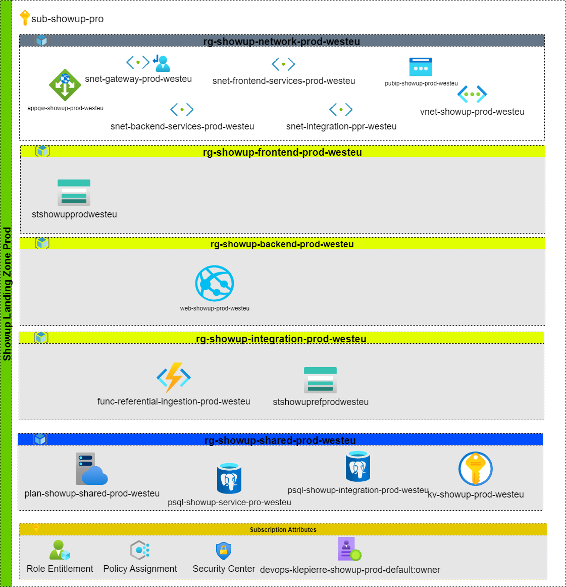

# Showup Production

## Showup Production requirements

| ID               | Name                                                                                                                                                   |
| :--------------- | :-------------------------------------------------------|
| OBS-AZ-SHOWUP-PROD-01 | All Azure resources must be deployed by using automation tools such as Terraform, Azure Resource Manager or any scripting solution that uses Azure API |
| OBS-AZ-SHOWUP-PROD-02 | The source code used to deploy the project must be managed in SCM tool such as Git                                                                     |
| OBS-AZ-SHOWUP-PROD-03 | Each deployment must be launched through a CI/CD process that check the code quality and execute release pipelines                                     |
| OBS-AZ-SHOWUP-PROD-04 | Klepierre Azure Dev Ops solution must be used as the application management live cycle tools of the project.                                           |

:Showup Production Zone Requirements

## Schema

## Description

The landing zone is exactly the same one as the pre production one. Please refer to that chapter.
