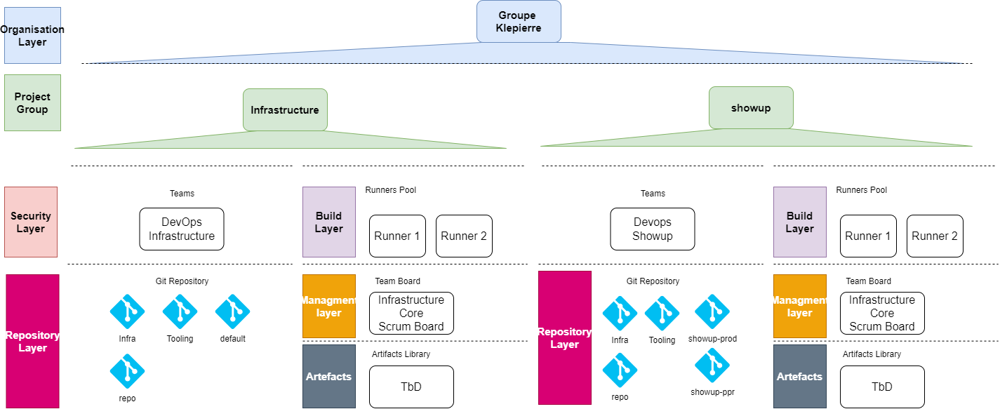
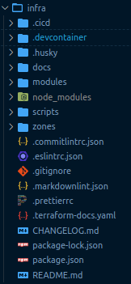
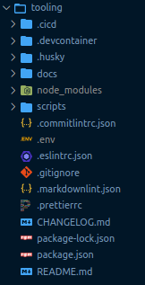
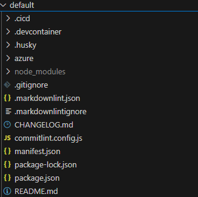
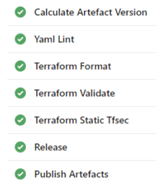
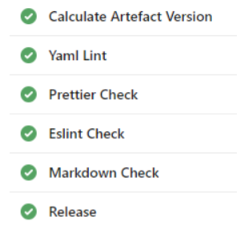
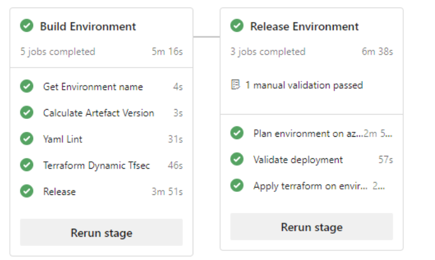

# Azure Devops

In that project, The Azure Devops CI/CD tool will be used to support the devops process. The instance used in the project is Klepierre’s one located
here: [https://dev.azure.com/klepierre](https://dev.azure.com/klepierre)

## Azure Devops General Architecture

The figure below presents the global Klepierre Azure Devops configuration for the project.

## Azure Devops Organization Layer

The Azure Devops Organization used for that project is kle.

The Azure Devops Organization is linked with Azure Active Directory so the configuration of users settings can be easily done. Orange digital
services Team members must have an account in the Azure Active Directory of the Klepierre’s tenant and will used it to authenticate themselves on
Azure Dev Ops.

For the enterprise scale landing zone deployment project, the Azure Devops Project configuration will be done by hand by an administrator of
the Azure Dev Ops Organization.

## Project Layer

Two new projects will be created to handle the infrastructure development for both core platefrom landing zone and the digit landing
zone. The name associated to those projects are:

- Infrastructure Core,
- Showup

Those projects will follow the Scrum process.

## Security Layer

For both project, the default project Team will be used to manage user’s rights. All people involved in the project will be added in the
contributors groups of that team. To easily manage team members, one member of the Orange team will be declared as “administrator” of each
project.

## Build Layer

### Agent Pool

A new agent pool will be associated to both projects, the name of that pool is “infrastructure”

### Agent Queue

In each project agent pool a specific Agent Queue will be created to group the infrastructure agent.

### Agent

All virtual machine installed in the devops landing zone will be joined to the agent queue associated with the agent pool.

All agents must be declared with specific tags:

- Terraform
- Powershell Core
- Docker

### Build User Rights

The build user must have full access on all repository in order to produce automatic tagging and versionning of the code.

## Repository Layer

In the project infrastructure multiple repositories will be deployed to instantiate the Orange digital services Starter Kit.

| Repository Name | Purpose                                                                  |
| :-------------- | :----------------------------------------------------------------------- |
| Infra           | Used to build the terraform code of the infrastructure core landing zone                             |
| Tooling         | Used to store the tooling used by the infrastructure core project                                    |
| default         | Will be used to store terraform variable data and certificates for all platform zones and governance |
| Repo            | Use to manage all those repository as a monorepo                                                     |

:Infrastructure project repository layer

In the project showup multiple repositories will be deployed to instantiate the Orange digital services Starter Kit.

| Repository Name | Purpose                                                                  |
| :-------------- | :----------------------------------------------------------------------- |
| Infra           | Used to build the terraform code of the infrastructure core landing zone                             |
| Tooling         | Used to store the tooling used by the infrastructure core project                                    |
| showup-prod     | Will be used to store terraform variable data and certificates for the showup production landing zone|
| showup-dev     | Will be used to store terraform variable data and certificates for the showup dev landing zone        |
| Repo            | Use to manage all those repository as a monorepo                                                     |

:Infrastructure project repository layer

## Artefact Layer

Each time a new version is of the infrastructure is built, a code artefact is produced and uploaded in the Azure DevOps Artefact library.

## Management Layer

The infrastructure project must use the Agile Azure Devops Template  to be initiated

[https://docs.microsoft.com/en-us/azure/devops/boards/sprints/scrum-overview?view=azure-devops](https://docs.microsoft.com/en-us/azure/devops/boards/sprints/scrum-overview?view=azure-devops)

## Terraform code

### Project Infrastructure

#### Git Repositories

The project is based on various git repositories that concur together to store the project code base as defined in the Git Ops Strategy.

Here is the full list of repositories used in the project with details about their purpose:

| Repositories Name  | Purpose                                                                                       | name in repo manifest |
| :----------------- | :----------------------------------------------| :-------------------- |
| kle-gitops-infra   | Location where the landing zones are defined in Terraform.                                    | infra                 |
| kle-gitops-tooling | location where all the tools for building and deployment are defined (such as js scripts,...) | tooling               |
| kle-gitops-default | Will be used to store terraform variable data and certificates of the platform zones          | default               |
| kle-repo           | this Git repo is dedicated to store the repo manifest file                                    | non-applicable        |

: Git Repositories for infrastructure project

#### Infrastructure repository

##### Objective of this repository

This repository is dedicated to managing the terraform infrastructure code for all landing zones deployed in the plaform zone project.

##### Code structure

The following image presents the structure of the code that is used in the infrastructure repository:

##### Code details

The terraform code will be contained in the zones and modules folder.

| Name                 | Type   | Description                                                                                                                               |
| :------------------- | :----- | :----------------------------------------------------------- |
| .cicd                | Folder | Folder containing the pipelines for the CI (ie: AzureDevops, Azure dev ops)                                                               |
| .devcontainer        | Folder | Folder containing the devcontainer configuration                                                                                          |
| .husky               | Folder | Folder containing the git hooks scripts for a sanitized code base                                                                         |
| docs                 | Folder | Folder containing the documentation markdown files and assets (ie: png, jpeg,....)                                                        |
| modules              | Folder | Folder containing the local terraform modules used in the starterkit                                                                      |
| node_modules         | Folder | Folder containing the node modules. Do not touch it please it is used when doing npm install                                              |
| scripts              | Folder | Folder containing the repositories scripts                                                                                                |
| zones                | Folder | Folder containing the differents landing zones (ie: lz-genia-fin, lz-genia-hr)         |
| .commitlintrc        | File   | File holding the commitlint configuration                                                                                                 |
| .eslintrc            | File   | File holding the eslint configuration                                                                                                     |
| .gitignore           | File   | File containing the git files and folders to ignore in the versionning process                                                            |
| .markdownlint.json   | File   | File holding the markdownlint configuration                                                                                               |
| .prettierrc          | File   | File holding the prettier configuration for coherent file formatting                                                                      |
| .terraform-docs.yaml | File   | File holding the terraform-docs configuration                                                                                             |
| CHANGELOG.md         | File   | File holding the repository's changelog automatically updated via standard-version                                                        |
| package-lock.json    | File   | File holding the package-lock.json hash values. Do not touch it please                                                                    |
| package.json         | File   | File holding the package.json configuration It contains dependencies, scripts, configurations and many more to help build the infrasture. |
| README.md            | File   | File containing the documentation of the repository                                                                                       |

: Infrastructure repository code detail

Two zones will be defined in the repository under the zones/azure folder:

- **governance** : for the governance zone
- **connectivity** : for the connectivity zone
- **managment**: for the managment zone
- **devops**: for the devops zone
- **identity**: for the identity zone

#### Tooling repository

##### Objective of this repository

This repository is dedicated to managing the custom tooling code that is used in the starter kit. This tooling is mainly used by the CI/CD
process but can also be used by developers when they need to validate the code or to deploy without the CI/CD pipelines.

##### Code structure

The following image presents the structure of the code that is used in the git ops repository:

##### Code details

| Name               | Type   | Description                                                                                                                               |
| :----------------- | :----- | :-------------------------------------------------- |
| .cicd              | Folder | Folder containing the pipelines for the CI (ie: AzureDevops, Azure dev ops)                                                               |
| .devcontainer      | Folder | Folder containing the devcontainer configuration                                                                                          |
| .husky             | Folder | Folder containing the git hooks scripts for a sanitized code base                                                                         |
| docs               | Folder | Folder containing the documentation markdown files and assets (ie: png, jpeg,....)                                                        |
| node_modules       | Folder | Folder containing the node modules. Do not touch it please it is used when doing npm install                                              |
| scripts            | Folder | Folder containing the repositories scripts                                                                                                |
| .commitlintrc      | File   | File holding the commitlint configuration                                                                                                 |
| .env               | File   | Environment file used for bootstrapping projects                                                                                          |
| .eslintrc          | File   | File holding the eslint configuration                                                                                                     |
| .gitignore         | File   | File containing the git files and folders to ignore in the versionning process                                                            |
| .markdownlint.json | File   | File holding the markdownlint configuration                                                                                               |
| .prettierrc        | File   | File holding the prettier configuration for coherent file formatting                                                                      |
| CHANGELOG.md       | File   | File holding the repository's changelog automatically updated via standard-version                                                        |
| package-lock.json  | File   | File holding the package-lock.json hash values. Do not touch it please                                                                    |
| package.json       | File   | File holding the package.json configuration It contains dependencies, scripts, configurations and many more to help build the infrasture. |
| README.md          | File   | File containing the documentation of the repository                                                                                       |

:Git Ops tooling code detail

#### Environment repository for the infrastructure project

##### Objective of this repository

This repository is dedicated to store environment terraform configuration files (backend and variables) for the plaform landing zones. It
also provides the project with the definition of the CI/CD pipeline that enables the deployment on hyperscaler.

##### Code structure

##### Code details

| Name               | Type   | Description                                                                                                                               |
| :----------------- | :----- | :-------------------------------------------------------------------------------- |
| .cicd              | Folder | Folder containing the pipelines for the CI (ie: AzureDevops, Azure dev ops)                                                               |
| .devcontainer      | Folder | Folder containing the devcontainer configuration                                                                                          |
| .husky             | Folder | Folder containing the git hooks scripts for a sanitized code base                                                                         |
| azure/certs        | Folder | Folder containing the all the needed certificates allowing service principals to connect to Azure                                         |
| azure/lz-genia-fin | Folder | Folder containing the backend.tfvars and terraform.tfvars for the lz-genia-fin zone                                                       |
| scripts            | Folder | Folder containing the repositories scripts                                                                                                |
| .commitlintrc      | File   | File holding the commitlint configuration                                                                                                 |
| .env               | File   | Environment file used for bootstrapping projects                                                                                          |
| .eslintrc          | File   | File holding the eslint configuration                                                                                                     |
| .gitignore         | File   | File containing the git files and folders to ignore in the versionning process                                                            |
| .markdownlint.json | File   | File holding the markdownlint configuration                                                                                               |
| .prettierrc        | File   | File holding the prettier configuration for coherent file formatting                                                                      |
| CHANGELOG.md       | File   | File holding the repository's changelog automatically updated via standard-version                                                        |
| package-lock.json  | File   | File holding the package-lock.json hash values. Do not touch it please                                                                    |
| package.json       | File   | File holding the package.json configuration It contains dependencies, scripts, configurations and many more to help build the infrasture. |
| README.md          | File   | File containing the documentation of the repository                                                                                       |

:Environment repository code detail for plaform landing zone

### Project ShowUp

#### Git Repositories for showup project

The project is based on various git repositories that concur together to store the project code base as defined in the Git Ops Strategy.

Here is the full list of repositories used in the project with details about their purpose:

| Repositories Name      | Purpose                                                                                       | name in repo manifest |
| :--------------------- | :---------------------------------------- | :-------------------- |
| kle-gitops-infra       | Location where the landing zones are defined in Terraform.                                    | infra                 |
| kle-gitops-tooling     | location where all the tools for building and deployment are defined (such as js scripts,...) | tooling               |
| kle-gitops-showup-prod | Will be used to store terraform variable data and certificates of the showup prod environment | prod                  |
| kle-gitops-showup-dev  | Will be used to store terraform variable data and certificates of the showup dev environment  | dev                   |
| kle-repo               | this Git repo is dedicated to store the repo manifest file                                    | non-applicable        |

: Git Repositories for infrastructure project

#### Infrastructure repository for showup project

##### Objective of this repository

This repository is dedicated to managing the terraform infrastructure code for all landing zones deployed in the show up project.

##### Code structure

The following image presents the structure of the code that is used in the infrastructure repository:

##### Code details

The terraform code will be contained in the zones and modules folder.

| Name                 | Type   | Description                                                                                                                               |
| :------------------- | :----- | :----------------------------------------------------------- |
| .cicd                | Folder | Folder containing the pipelines for the CI (ie: AzureDevops, Azure dev ops)                                                               |
| .devcontainer        | Folder | Folder containing the devcontainer configuration                                                                                          |
| .husky               | Folder | Folder containing the git hooks scripts for a sanitized code base                                                                         |
| docs                 | Folder | Folder containing the documentation markdown files and assets (ie: png, jpeg,....)                                                        |
| modules              | Folder | Folder containing the local terraform modules used in the starterkit                                                                      |
| node_modules         | Folder | Folder containing the node modules. Do not touch it please it is used when doing npm install                                              |
| scripts              | Folder | Folder containing the repositories scripts                                                                                                |
| zones                | Folder | Folder containing the differents landing zones (ie: lz-genia-fin, lz-genia-hr)         |
| .commitlintrc        | File   | File holding the commitlint configuration                                                                                                 |
| .eslintrc            | File   | File holding the eslint configuration                                                                                                     |
| .gitignore           | File   | File containing the git files and folders to ignore in the versionning process                                                            |
| .markdownlint.json   | File   | File holding the markdownlint configuration                                                                                               |
| .prettierrc          | File   | File holding the prettier configuration for coherent file formatting                                                                      |
| .terraform-docs.yaml | File   | File holding the terraform-docs configuration                                                                                             |
| CHANGELOG.md         | File   | File holding the repository's changelog automatically updated via standard-version                                                        |
| package-lock.json    | File   | File holding the package-lock.json hash values. Do not touch it please                                                                    |
| package.json         | File   | File holding the package.json configuration It contains dependencies, scripts, configurations and many more to help build the infrasture. |
| README.md            | File   | File containing the documentation of the repository                                                                                       |

: Infrastructure repository code detail

Two zones will be defined in the repository under the zones/azure folder:

- **showup** : for the showup zone

#### Tooling repository for showup project

##### Objective of this repository

This repository is dedicated to managing the custom tooling code that is used in the starter kit. This tooling is mainly used by the CI/CD
process but can also be used by developers when they need to validate the code or to deploy without the CI/CD pipelines.

##### Code structure

The following image presents the structure of the code that is used in the git ops repository:

##### Code details

| Name               | Type   | Description                                                                                                                               |
| :----------------- | :----- | :-------------------------------------------------- |
| .cicd              | Folder | Folder containing the pipelines for the CI (ie: AzureDevops, Azure dev ops)                                                               |
| .devcontainer      | Folder | Folder containing the devcontainer configuration                                                                                          |
| .husky             | Folder | Folder containing the git hooks scripts for a sanitized code base                                                                         |
| docs               | Folder | Folder containing the documentation markdown files and assets (ie: png, jpeg,....)                                                        |
| node_modules       | Folder | Folder containing the node modules. Do not touch it please it is used when doing npm install                                              |
| scripts            | Folder | Folder containing the repositories scripts                                                                                                |
| .commitlintrc      | File   | File holding the commitlint configuration                                                                                                 |
| .env               | File   | Environment file used for bootstrapping projects                                                                                          |
| .eslintrc          | File   | File holding the eslint configuration                                                                                                     |
| .gitignore         | File   | File containing the git files and folders to ignore in the versionning process                                                            |
| .markdownlint.json | File   | File holding the markdownlint configuration                                                                                               |
| .prettierrc        | File   | File holding the prettier configuration for coherent file formatting                                                                      |
| CHANGELOG.md       | File   | File holding the repository's changelog automatically updated via standard-version                                                        |
| package-lock.json  | File   | File holding the package-lock.json hash values. Do not touch it please                                                                    |
| package.json       | File   | File holding the package.json configuration It contains dependencies, scripts, configurations and many more to help build the infrasture. |
| README.md          | File   | File containing the documentation of the repository                                                                                       |

:Git Ops tooling code detail

#### Environment repository for the showup project

##### Objective of this repository

This repository is dedicated to store environment terraform configuration files (backend and variables) for the plaform landing zones. It
also provides the project with the definition of the CI/CD pipeline that enables the deployment on hyperscaler.

##### Code structure

##### Code details

| Name               | Type   | Description                                                                                                                               |
| :----------------- | :----- | :-------------------------------------------------------------------------------- |
| .cicd              | Folder | Folder containing the pipelines for the CI (ie: AzureDevops, Azure dev ops)                                                               |
| .devcontainer      | Folder | Folder containing the devcontainer configuration                                                                                          |
| .husky             | Folder | Folder containing the git hooks scripts for a sanitized code base                                                                         |
| azure/certs        | Folder | Folder containing the all the needed certificates allowing service principals to connect to Azure                                         |
| azure/lz-genia-fin | Folder | Folder containing the backend.tfvars and terraform.tfvars for the lz-genia-fin zone                                                       |
| scripts            | Folder | Folder containing the repositories scripts                                                                                                |
| .commitlintrc      | File   | File holding the commitlint configuration                                                                                                 |
| .env               | File   | Environment file used for bootstrapping projects                                                                                          |
| .eslintrc          | File   | File holding the eslint configuration                                                                                                     |
| .gitignore         | File   | File containing the git files and folders to ignore in the versionning process                                                            |
| .markdownlint.json | File   | File holding the markdownlint configuration                                                                                               |
| .prettierrc        | File   | File holding the prettier configuration for coherent file formatting                                                                      |
| CHANGELOG.md       | File   | File holding the repository's changelog automatically updated via standard-version                                                        |
| package-lock.json  | File   | File holding the package-lock.json hash values. Do not touch it please                                                                    |
| package.json       | File   | File holding the package.json configuration It contains dependencies, scripts, configurations and many more to help build the infrasture. |
| README.md          | File   | File containing the documentation of the repository                                                                                       |

:Environment repository code detail for plaform landing zone

## Pipeline Strategy for both project

You will find here a short description of what is doing each pipeline on each repository. On a pull/merge request, each pipeline is performing
tests on the code based. When the merge request is accepted, each pipeline performs a “release”:

- automatic CHANGELOG.md updates and generation
- automatic package.json version update
- automatic git tagging with the new version

In the infra repository, you will find CI pipelines (ie: Azure Devops, Azure dev ops-CI) sequencing the following jobs/tasks:

In the tooling repository, you will find CI pipelines (ie: Azure Devops,
Azure dev ops-CI) sequencing the following jobs/tasks:

In the environment repositories (for finance and HR) you will find CI/CD pipelines (ie: Azure
Devops, Azure dev ops-CI) sequencing the following jobs/tasks:

