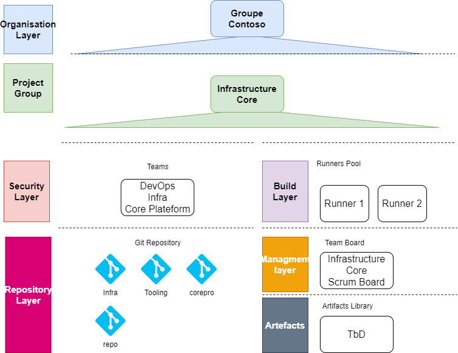
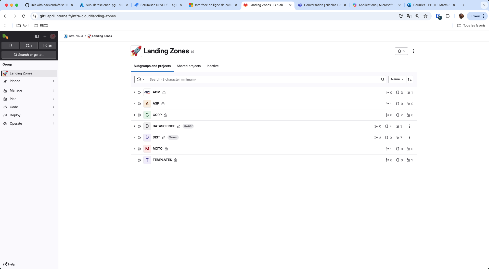
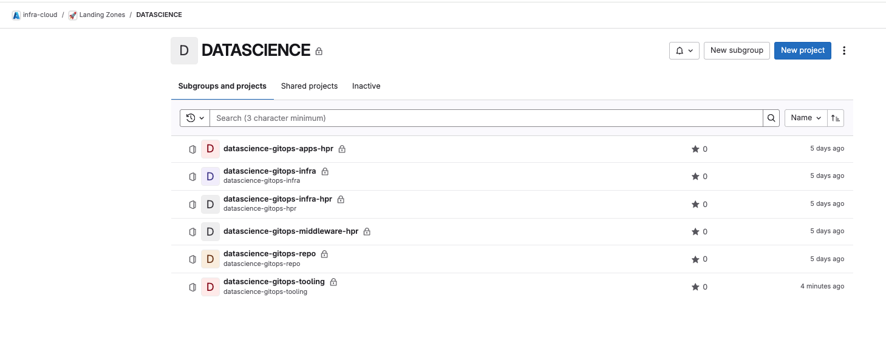

# Git Lab

In that project, the Gitlab tool will be used to support the
devops process. The instance used in the project is April's one located
here:

[https://git-oab.si.fr.intraoranget](https://git2.april.interne.fr/)

This gitlab instance is located on premises, and managed by the April SD Cloud Team.

## GitLab General Architecture

The figure below presents the global April Azure Devops configuration
for the project.

## Gitlab Organization Layer

The Gitlab organization used for that project is group April.

That Gitlab organization is managed in an on premises Git Lab Instance operate by April team.

The Git Lab Organization is linked with Azure Active Directory so the configuration of users setting can be easily done.
Marketplace Team members and all contractors working for that team must have an account in the Azure Active Directory
of April and will used it to authenticate themselves on Git Lab.

For the datascience landing zone deployment project, the Git Lab Projects configuration will be done by hand in the GUI of Gitlab as
April did not implement IaC for Gitlab managmenent.

## Project Layer

A new group of project will be created to handle the infrastructure
development for datascience landing zone. The name associated to that group is:

- DATASCIENCE

## Security Layer

A specific user group will be created in Git Lab to manage all users that will need access to Git Repositories.

## Build Layer

### Agent Pool

Each git lab runner deployed in the project landing zone will be associated to the datasciences repositories.

### Agent

In the datascience project, Gitlab runners used to perform the CICD process will be deployed in the datascience landing zone itself
and won't be managed by the April SD Cloud team.

Those agents will be deployed as virtual machines based on Linux operating system. The following tools will be installed on those agents:

- Docker
- nodejs
- gitlabrunner
- sshd (access for management)

In each Virtual Machines two runners will be configured.

To get specific information about the SKU of those vm please refer to the the datascience landing zone documentation.

## Repository Layer

In the project infrastructure core multiple repositories will be
deployed to instantiate the Orange digital services Starter Kit.

| Repository Name                   | Purpose                                                                                              |
| :-------------------------------- | :------------------------------------------------------ |
| datascience-gitops-infra          | Used to build the terraform code of the infrastructure core landing zone                             |
| datascience-gitops-tooling        | Used to store the tooling used by the infrastructure core project                                    |
| datascience-gitops-infra-hpr      | Will be used to store terraform variable data and certificates used to deploy infrastructure stack   |
| datascience-gitops-middleware-hpr | Will be use to store terraform variable data and certificate used to deploy middleware stack         |
| datascience-gitops-apps-hpr       | Will be use to store terraform variable data and certificate used to deploy applications stack       |
| datascience-gitops-repo           | Use to manage all those repository as a monorepo                                                     |

: Repository list

### Management Layer

The project will use a separate Ticket tools to manage the project. April uses Jira Cloud to manage the project. The instance can
be found here: [https://apriltechnologies.atlassian.net/jira/your-work](https://apriltechnologies.atlassian.net/jira/your-work)
