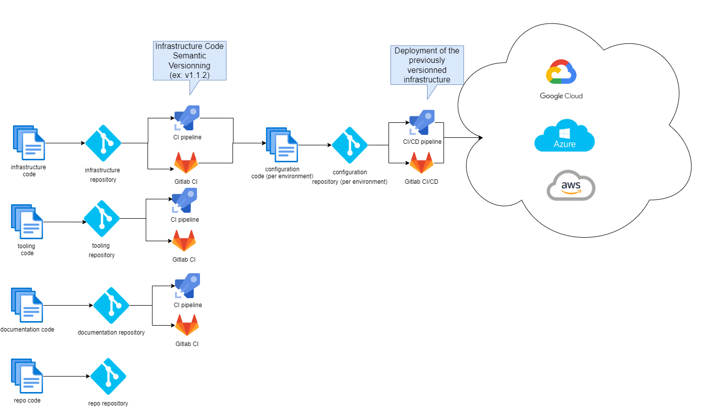
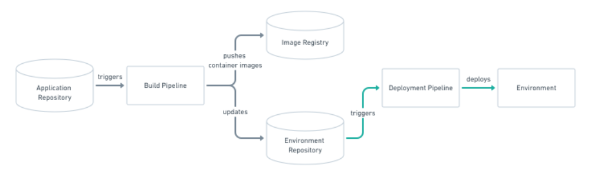
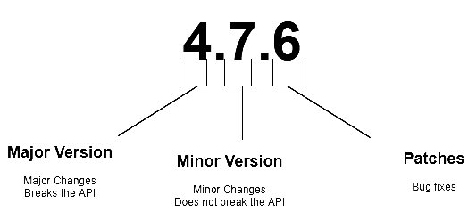

# Devops process

## General development process

### Devops global overview



### About Git Ops

GitOps is a way of implementing Continuous Deployment for cloud native applications. Its core tool is based on any type of source version
control.

The configuration of the application is generally detached from its source code. It takes the result of the build version that is tracked in
the repository.

GitOps is based on a declarative description of the desired infrastructure's environments and automates the deployments throughout pipelines.

### How does GitOps work?

#### Configuration as base

GitOps organizes the deployment process based on source control.

It mainly uses at least two repositories in order to deploy an application.

The application repository contains the source code of the application and the deployment manifests to deploy the application.

The environment configuration repository contains all deployment manifests of the currently desired infrastructure of a deployment
environment. It describes what applications and infrastructural services (message broker, service mesh, monitoring tools, …) should run with what
configuration and version of the deployment environment.

#### Push-based deployments



#### Pull based deployments


In the Klepierre project, as it is based on the Orange digital services
Starter Kit, the GitOps process is based on the push based methodology.

### Branching Strategy

In the project, the management of the source code will follow the Trunk
based branching strategy.


The goal of this branching strategy is to be able to deliver fast to customers.

This strategy has its prerequisites that we will list below but it is the one the Azure practice team has chosen for CI/CD (Continuous
Integration/Continuous Deployment).

The prerequisite for working with that strategy is:
- short-lived branches
- testing continuously
- validation built-in process
- environment continuous deployment

### Semantic Versioning

For the project, the versioning strategy must be semantic versioning (semver).

The versioning calculation is done by the development tool present in the devcontainer and based on the commit message.



For a version number MAJOR.MINOR.PATCH, increment MAJOR version when you make incompatible changes MINOR version when you add functionality in
backwards compatible manner PATCH version when you make backward compatible bug fixes

### Terraform best practices

#### Code Format Validation Overview

***Code format check*** is important practice in build process in order to have a readable and identical code format. Therefore, each push to
the project repo should be followed by a code format validation prior to the merge process. This check can be done in the pre-commit phase in
order to have cleaner git commits. The terraform command doing that check is:

```
terraform fmt -recursive -check
```

For more information, please refers to
https://www.terraform.io/docs/cli/commands/fmt.html

#### Code Semantic Validation Overview

***Terraform Code validation*** is an important practice in the build process. Therefore, each push to the project repo should be followed by
a code validation prior to the merge process. This check is done in the pre-commit phase in order to have cleaner git commits. The terraform
command to do the check is:

```
terraform validate.
```

For more information, please refers to
<https://www.terraform.io/docs/cli/commands/validate.html>

#### Code Convention

Please refer to [Conventions](5-conventions.md)

```{.include shift-heading-level-by=0}
./4-devops-process-ado.md
```
