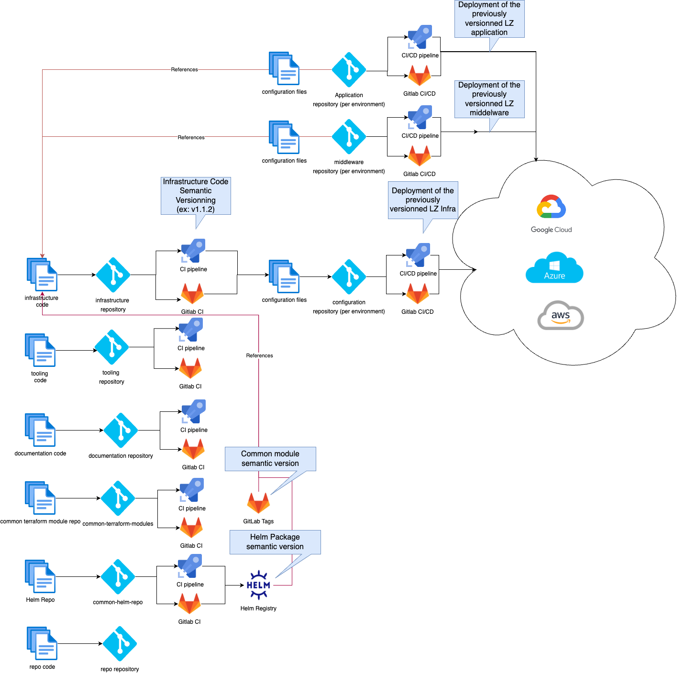
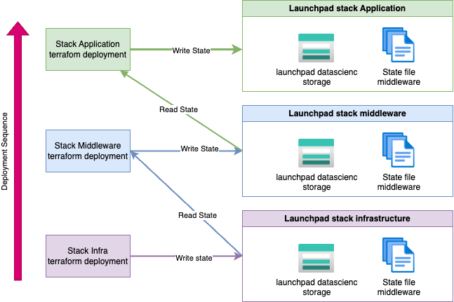
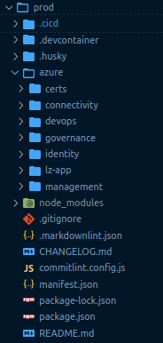

# Devops process

## General development process

### Devops global overview



### About Git Ops

GitOps is a way of implementing Continuous Deployment for cloud native
applications. Its core tool is based on any type of source version
control.

The configuration of the application is generally detached from its
source code. It takes the result of the build version that is tracked in
the repository.

GitOps is based on a declarative description of the desired
infrastructure's environments and automates the deployments throughout
pipelines.

### How does GitOps work?

#### Configuration as base

GitOps organizes the deployment process based on source control.

It mainly uses at least two repositories in order to deploy an
application.

The application repository contains the source code of the application
and the deployment manifests to deploy the application.

The environment configuration repository contains all deployment
manifests of the currently desired infrastructure of a deployment
environment. It describes what applications and infrastructural services
(message broker, service mesh, monitoring tools, …) should run with what
configuration and version of the deployment environment.

#### Push-based deployments


#### Pull based deployments


In the Circet project, as it is based on the Orange digital services
Starter Kit, the GitOps process is based on the push based methodology.

### Branching Strategy

In the project, the management of the source code will follow the Trunk
based branching strategy.


The goal of this branching strategy is to be able to deliver fast to
customers.

This strategy has its prerequisites that we will list below but it is
the one the Azure practice team has chosen for CI/CD (Continuous
Integration/Continuous Deployment).

The prerequisite for working with that strategy is:

- short-lived branches
- testing continuously
- validation built-in process
- environment continuous deployment

### Semantic Versioning

For the project, the versioning strategy must be semantic versioning
(semver).

The versioning calculation is done by the development tool present in
the devcontainer and based on the commit message.


For a version number MAJOR.MINOR.PATCH, increment MAJOR version when you
make incompatible changes MINOR version when you add functionality in
backwards compatible manner PATCH version when you make backward
compatible bug fixes

### Terraform best practices

#### Code Format Validation Overview

***Code format check*** is important practice in build process in order
to have a readable and identical code format. Therefore, each push to
the project repo should be followed by a code format validation prior to
the merge process. This check can be done in the pre-commit phase in
order to have cleaner git commits. The terraform command doing that
check is:

```
terraform fmt -recursive -check
```

For more information, please refers to
<https://www.terraform.io/docs/cli/commands/fmt.html>

#### Code Semantic Validation Overview

***Terraform Code validation*** is an important practice in the build
process. Therefore, each push to the project repo should be followed by
a code validation prior to the merge process. This check is done in the
pre-commit phase in order to have cleaner git commits. The terraform
command to do the check is

```
terraform validate.
```

For more information, please refers to
<https://www.terraform.io/docs/cli/commands/validate.html>

#### Code Convention

Please refer to [Conventions](5-conventions.md)

### Terraform code

#### Git Repositories

The project is based on various git repositories that concur together to
store the project code base as defined in the Git Ops Strategy.

Here is the full list of repositories used in the project with details
about their purpose:

| Repositories Name                 | Purpose                                                                                                 | name in repo manifest |
| :-------------------------------- | :------------------------------------------------------------------------------------------------------ | :-------------------- |
| datascience-gitops-infra          | Location where the landing zones are defined in Terraform.                                              | infra                 |
| datascience-gitops-tooling        | location where all the tools for building and deployment are defined (such as js scripts,...)           | tooling               |
| datascience-gitops-env-hpr        | this repo store the backend.tfvars and terraform.tfvars
 and the CI/CD used to deploy the infrastructure                                                                                              | hors prod             |
| datascience-gitops-middleware-hpr | this repo store the backend.tfvars and terraform.tfvars for the middleware deployment                   | hors prod             |
| datascience-gitops-apps-hpr       | this repo store the backend.tfvars and terraform.tfvars for the applications deployment                 | hors prod             |
| april-helm-repo                   | this repo store the code for helm chart                                                                 | na                    |
| april-terraform-common-module     | this repo store the code common April terraform module shared accross BU                                | na                    |
| april-repo                        | this Git repo is dedicated to store the repo manifest file                                              | non-applicable        |

:Git Repositories

#### Terraform states

As multiple developers will be working on the project, it is important store the backend of terraform in a shared location.
The azurerm provider will be used to store the terraform state in an Azure Storage Account. Moreover the overall Datascience landing zone will
be cut in multiple stack that will together form the landing zone. Each stack will have its own terraform state file and ideally its own service principal.

| Stack              | level | Description                                              | Variable location                 |
| :----------------- | :---: | :------------------------------------------------------- | :-------------------------------- |
| Infrastructure HPR |   1   | this stack deploy azure ressources on the datascience LZ | datascience-gitops-env-hpr        |
| Middleware HPR     |   2   | this stack deploy middleware inside AKS                  | datascience-gitops-middleware-hpr |
| Application HPR    |   3   | this stack deploy application inside AKS                 | datascience-gitops-apps-hpr       |

: Lists of stacks deployed in the project

To complete the deployment of the landing zone, all stacks must be deployed but change can occurs at one level without impacting the other.
As a consequence each stack must be aware of what was deployed in the stack above. That communication will be done by using the terraform
remote state data source.

The following figure shows the terraform state architecture of the project:



#### Infrastructure repository

##### Objective of this repository

This repository is dedicated to managing the terraform infrastructure code for all stacks deployed in the project. Multiple stack will be deployed in the project
to ensure the separation of concerns and the security of the project.

##### Code structure

The following image presents the structure of the code that is used in
the infrastructure repository:


##### Code details

The terraform code will be contained in the zones and modules folder.

| Name                 | Type   | Description                                                                                                                               |
| :------------------- | :----- | :---------------------------------------------------------------------------------------------------------------------------------------- |
| .cicd                | Folder | Folder containing the pipelines for the CI (ie: AzureDevops, Azure dev ops)                                                               |
| .devcontainer        | Folder | Folder containing the devcontainer configuration                                                                                          |
| .husky               | Folder | Folder containing the git hooks scripts for a sanitized code base                                                                         |
| docs                 | Folder | Folder containing the documentation markdown files and assets (ie: png, jpeg,....)                                                        |
| modules              | Folder | Folder containing the local terraform modules used in the starterkit                                                                      |
| node_modules         | Folder | Folder containing the node modules. Do not touch it please it is used when doing npm install                                              |
| scripts              | Folder | Folder containing the repositories scripts                                                                                                |
| zones                | Folder | Folder containing the differents zones constituting the hub and spoke architecture (ie: identity, management, connectivity, ....)         |
| .commitlintrc        | File   | File holding the commitlint configuration                                                                                                 |
| .eslintrc            | File   | File holding the eslint configuration                                                                                                     |
| .gitignore           | File   | File containing the git files and folders to ignore in the versionning process                                                            |
| .markdownlint.json   | File   | File holding the markdownlint configuration                                                                                               |
| .prettierrc          | File   | File holding the prettier configuration for coherent file formatting                                                                      |
| .terraform-docs.yaml | File   | File holding the terraform-docs configuration                                                                                             |
| CHANGELOG.md         | File   | File holding the repository's changelog automatically updated via standard-version                                                        |
| package-lock.json    | File   | File holding the package-lock.json hash values. Do not touch it please                                                                    |
| package.json         | File   | File holding the package.json configuration It contains dependencies, scripts, configurations and many more to help build the infrasture. |
| README.md            | File   | File containing the documentation of the repository                                                                                       |

:Infrastructure repository code detail

#### Tooling repository

##### Objective of this repository

This repository is dedicated to managing the custom tooling code that is
used in the starter kit. This tooling is mainly used by the CI/CD
process but can also be used by developers when they need to validate
the code or to deploy without the CI/CD pipelines.

##### Code structure

The following image presents the structure of the code that is used in
the git ops repository:


##### Code details

| Name               | Type   | Description                                                                                                                               |
| :----------------- | :----- | :---------------------------------------------------------------------------------------------------------------------------------------- |
| .cicd              | Folder | Folder containing the pipelines for the CI (ie: AzureDevops, Azure dev ops)                                                               |
| .devcontainer      | Folder | Folder containing the devcontainer configuration                                                                                          |
| .husky             | Folder | Folder containing the git hooks scripts for a sanitized code base                                                                         |
| docs               | Folder | Folder containing the documentation markdown files and assets (ie: png, jpeg,....)                                                        |
| node_modules       | Folder | Folder containing the node modules. Do not touch it please it is used when doing npm install                                              |
| scripts            | Folder | Folder containing the repositories scripts                                                                                                |
| .commitlintrc      | File   | File holding the commitlint configuration                                                                                                 |
| .env               | File   | Environment file used for bootstrapping projects                                                                                          |
| .eslintrc          | File   | File holding the eslint configuration                                                                                                     |
| .gitignore         | File   | File containing the git files and folders to ignore in the versionning process                                                            |
| .markdownlint.json | File   | File holding the markdownlint configuration                                                                                               |
| .prettierrc        | File   | File holding the prettier configuration for coherent file formatting                                                                      |
| CHANGELOG.md       | File   | File holding the repository's changelog automatically updated via standard-version                                                        |
| package-lock.json  | File   | File holding the package-lock.json hash values. Do not touch it please                                                                    |
| package.json       | File   | File holding the package.json configuration It contains dependencies, scripts, configurations and many more to help build the infrasture. |
| README.md          | File   | File containing the documentation of the repository                                                                                       |

:Git Ops tooling code detail

#### Environment repository

##### Objective of this repository

This repository is dedicated to store each environment terraform
configuration files (backend and variables) for each landing zone. It
also provides the project with the definition of the CI/CD pipeline that
enables the deployment on hyperscaler. For the Circet project, there
will be only one environment repository dedicated to store the
production environment variable values.

##### Code structure



##### Code details

| Name               | Type   | Description                                                                                                                               |
| :----------------- | :----- | :---------------------------------------------------------------------------------------------------------------------------------------- |
| .cicd              | Folder | Folder containing the pipelines for the CI (ie: AzureDevops, Azure dev ops)                                                               |
| .devcontainer      | Folder | Folder containing the devcontainer configuration                                                                                          |
| .husky             | Folder | Folder containing the git hooks scripts for a sanitized code base                                                                         |
| azure/certs        | Folder | Folder containing the all the needed certificates allowing service principals to connect to Azure                                         |
| azure/connectivity | Folder | Folder containing the backend.tfvars and terraform.tfvars for the connectivity zone                                                       |
| azure/devops       | Folder | Folder containing the backend.tfvars and terraform.tfvars for the connectivity zone                                                       |
| azure/governance   | Folder | Folder containing the backend.tfvars and terraform.tfvars for the connectivity zone                                                       |
| azure/identity     | Folder | Folder containing the backend.tfvars and terraform.tfvars for the identity zone                                                           |
| azure/lz-app       | Folder | Folder containing the backend.tfvars and terraform.tfvars for the lz-app zone                                                             |
| azure/management   | Folder | Folder containing the backend.tfvars and terraform.tfvars for the management zone                                                         |
| node_modules       | Folder | Folder containing the node modules. Do not touch it please it is used when doing npm install                                              |
| scripts            | Folder | Folder containing the repositories scripts                                                                                                |
| .commitlintrc      | File   | File holding the commitlint configuration                                                                                                 |
| .env               | File   | Environment file used for bootstrapping projects                                                                                          |
| .eslintrc          | File   | File holding the eslint configuration                                                                                                     |
| .gitignore         | File   | File containing the git files and folders to ignore in the versionning process                                                            |
| .markdownlint.json | File   | File holding the markdownlint configuration                                                                                               |
| .prettierrc        | File   | File holding the prettier configuration for coherent file formatting                                                                      |
| CHANGELOG.md       | File   | File holding the repository's changelog automatically updated via standard-version                                                        |
| package-lock.json  | File   | File holding the package-lock.json hash values. Do not touch it please                                                                    |
| package.json       | File   | File holding the package.json configuration It contains dependencies, scripts, configurations and many more to help build the infrasture. |
| README.md          | File   | File containing the documentation of the repository                                                                                       |

:Environment repository code detail

### Pipeline Strategy

You will find here a short description of what is doing each pipeline on
each repository. On a pull/merge request, each pipeline is performing
tests on the code based. When the merge request is accepted, each
pipeline performs a “release”:

- automatic CHANGELOG.md updates and generation
- automatic package.json version update
- automatic git tagging with the new version

In the infra repository, you will find CI pipelines (ie: Azure Devops,
Azure dev ops-CI) sequencing the following jobs/tasks:


In the tooling repository, you will find CI pipelines (ie: Azure Devops,
Azure dev ops-CI) sequencing the following jobs/tasks:


In the &lt;env&gt; repositories you will find CI/CD pipelines (ie: Azure
Devops, Azure dev ops-CI) sequencing the following jobs/tasks:


```{.include shift-heading-level-by=1}
./4-devops-process-gitlab.md
```
